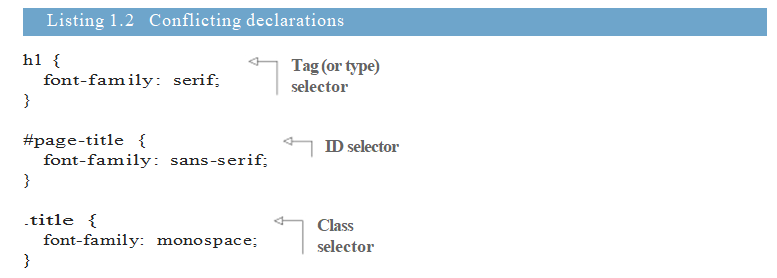

# about this book

Thế giới của ngôn ngữ CSS đang ngày càng phát triển . Ngày càng có nhiều nhà phát triển web trong ngành thực sự tin rằng trong khi họ nghĩ họ hiểu  CSS, họ không biết CSS rõ ràng, sâu sắc như thế nào . Trong những năm gần đây, ngôn ngữ đã phát triển, do đó, ngay cả những nhà phát triển đã từng thành thạo CSS cũng có thể tìm thấy một bộ kỹ năng hoàn toàn mới để bắt kịp. Cuốn sách này nhằm đáp ứng cả hai nhu cầu này: cung cấp sự thông thạo sâu sắc về ngôn ngữ và giúp bạn tăng tốc về những phát triển gần đây và các tính năng mới của CSS.

Cuốn sách này có tiêu đề CSS in Depth, nhưng nó cũng là một cuốn sách về bề rộng. Trường hợp các khái niệm là khó khăn hoặc thường bị hiểu lầm, tôi sẽ giải thích chi tiết về cách họ làm việc và lý do tại sao họ hành xử theo cách họ làm. Trong các chương khác, tôi có thể không làm cạn kiệt chủ đề, nhưng tôi sẽ cung cấp cho bạn đủ kiến thức để làm việc hiệu quả với nó và chỉ cho bạn hướng dẫn đúng nếu bạn muốn nâng cao kiến thức của mình. Trong tất cả, cuốn sách này sẽgiúp bạn hiểu thêm về các điểm còn chưa biết .

Một số chủ đề có thể tự bảo đảm toàn bộ sách: hoạt hình, kiểu chữ, thậm chí cả flexbox và bố cục lưới. Mục tiêu của tôi là bổ sung kiến thức, giúp bạn củng cố những điểm yếu và mang đến  cho bạn tình yêu dành cho ngôn ngữ.

# Who should read this book
Đầu tiên và quan trọng nhất, cuốn sách này dành cho các nhà phát triển đã mệt mỏi khi phải làm việc  với CSS và sẵn sàng thực sự hiểu cách thức hoạt động của nó. Bạn có thể là người mới bắt đầu, hoặc bạn có thể có mười lăm năm kinh nghiệm.

Tôi hy vọng bạn có một sự hiểu biết sơ sài về HTML, CSS, và một chút về JavaScript. Miễn là bạn làm quen với cú pháp cơ bản của CSS, bạn chắc chắn sẽ có thể làm theo cùng với cuốn sách này. Nhưng nó chủ yếu được viết cho các nhà phát triển người đã dành thời gian với CSS, gặp khó khăn và thất vọng. Ở những nơi tôi sử dụng JavaScript, tôi đã giữ nó đơn giản nhất có thể, miễn là bạn có thể theo dõi cùng với một vài đoạn mã ngắn, bạn nên có kiến thức tốt.

Thay vào đó, nếu bạn là một nhà thiết kế đang tìm cách bước vào thế giới thiết kế web, tôi hy vọng gờ bạn cũng sẽ học được rất nhiều từ CSS trong Depth, mặc dù tôi không có ý định viết nó với bạn. Cuốn sách cũng có thể cung cấp một số cái nhìn sâu sắc về viễn cảnh của các nhà phát triển mà bạn sẽ làm việc cùng.

# How this book is organized
Cuốn sách dài 16 chương, được chia thành bốn phần. Trong phần 1, ”Đánh giá các phần cơ bản”, chúng tôi sẽ quay lại những điều cơ bản, tập trung vào một số chi tiết bạn có thể bỏ lỡ lần đầu tiên:

■ Chương 1 bao gồm các cascade  và inheritance. Những khái niệm này kiểm soát Style  được áp dụng cho các yếu tố trên trang.

■ Chương 2 thảo luận về các đơn vị tương đối, nhấn mạnh vào em và rem. Quan hệ giữa các đơn vị là các công cụ linh hoạt và quan trọng trong CSS và chương này sẽ giúp bạn làm quen với chúng.

■ Chương 3 bao gồm mô hình hộp. Điều này liên quan đến việc kiểm soát kích thước của các yếu tố trên trang và lượng không gian giữa chúng.

Trong phần 2, bố cục của Master, tôi đã hướng dẫn bạn các công cụ chính để trình bày các yếu tố trên trang:

■ Chương 4 sử dụng floats  để bố trí. Chúng tôi sẽ xây dựng một trang nhiều màu và nhìn vào việc thuần hóa một số khía cạnh kỳ quặc của floats .

■ Chương 5 dạy flexbox, một phương pháp bố trí khá mới. Nó bắt đầu bằng các khái niệm cơ bản và chuyển sang các ví dụ bố trí thực tế.

■ Chương 6 giới thiệu công cụ bố trí hoàn toàn mới : lưới. Nó làm cho  việc bố trí có thể thực hiện dc , điều không thể trong CSS cho đến bây giờ.

■ Chương 7 đi sâu vào định vị bằng cách sử dụng thuộc tính vị trí: tuyệt đối định vị, định vị cố định, và nhiều hơn nữa. Đây là một lĩnh vực gặp nhiều rắc rối, và sự hiểu biết vững chắc là điều cần thiết.

■ Chương 8 bao gồm thiết kế đáp ứng. Chúng tôi sẽ xem xét ba nguyên tắc chính để xây dựng các trang web hoạt động trên một loạt các kích cỡ màn hình và loại thiết bị.

Trong phần 3,” CSS ở quy mô”, chúng tôi sẽ xem xét một số thực tiễn tốt nhất gần đây. Nó giúp làm cho các yếu tố trông như bạn muốn trên trang. Nó  giúp tổ chức code của bạn để nó có thể được hiểu và duy trì trong tương lai khi ứng dụng web của bạn phát triển và phát triển. Các chương này sẽ dạy cho bạn một số kỹ thuật quan trọng để quản lý code của bạn:

■ Chương 9 hướng dẫn cách tổ chức CSS của bạn theo cách mô đun, để code của bạn có thể tái sử dụng và bảo trì.

■ Chương 10 dẫn bạn đi qua việc xây dựng một thư viện mẫu. Đây là một phần quan trọng của việc sử dụng và duy trì CSS trên một nhóm.

Trong phần 4, “chủ đề nâng cao”,  tôi sẽ giúp bạn làm quen với thế giới thiết kế. Chúng tôi sẽ xem xét các cân nhắc quan trọng khi làm việc với một nhà thiết kế và cách tự mình thực hiện một chút công việc thiết kế vì đôi khi bạn sẽ cần phải:

■ Chương 11 thảo luận về bóng, độ dốc và chế độ hòa trộn. Những cái này làm việc cùng nhau để xây dựng một giao diện người dùng thanh lịch.

■ Chương 12 cho thấy cách làm việc với độ tương phản, màu sắc và không gian. Chú ý đến những chi tiết này đi một chặng đường dài để làm cho một thiết kế tốt trở thành một thiết kế tuyệt vời.

■ Chương 13 là về kiểu chữ web: sử dụng các tệp phông chữ trực tuyến để mang lại cá tính độc đáo cho trang web hoặc ứng dụng của bạn.

■ Chương 14 mang lại chuyển động cho trang bằng các hiệu ứng chuyển tiếp, thay đổi hình dạng,màu hoặc kích thước của một yếu tố trên trang.

■ Chương 15 bao gồm các biến đổi, là một công cụ quan trọng để sử dụng cùng với chuyển tiếp và hình ảnh động. Chương này cũng thảo luận về ý nghĩa hiệu suất của chuyển động trên trang.

■ Chương 16 thảo luận về hiệu ứng  keyframe. Bạn học cách sử dụng phức tạp chuyển động để truyền đạt ý nghĩa cho người dùng.

Ngoài ra còn có hai phụ lục:

■ Phụ lục A là tài liệu tham khảo về tất cả các loại bộ chọn CSS.

■ Phụ lục B là phần giới thiệu về tiền xử lý. Nếu bạn chưa quen với tiền xử lý, bạn có thể muốn bắt đầu với phụ lục này trước.

Tôi đã đặt rất nhiều nỗ lực vào sự phát triển của các chủ đề trong cuốn sách này. Tôi bắt đầu với những điều cần thiết mà bạn phải biết. Từ đó, các chủ đề xây dựng lẫn nhau. Ở nhiều nơi, tôi đề cập đến các khái niệm trước đó và làm việc để gắn kết chúng lại với nhau khi có liên quan. Mặc dù tôi đã bao gồm các tài liệu tham khảo hữu ích ở những nơi, tôi khuyến khích bạn đọc các chương theo thứ tự.

# Part 1
# Reviewing the fundamentals
phần 1 sẽ tìm hiểu sâu về các phần thiết yếu nhất của CSS, xếp tầng, các đơn vị tương đối và mô hình hộp. Các nguyên tắc cơ bản này, được đề cập trong ba chương đầu tiên này, kiểm soát các kiểu được áp dụng cho các thành phần trên trang và cách xác định kích thước của các yếu tố đó. Một sự hiểu biết toàn diện về các chủ đề này là nền tảng cho mọi thứ khác trong cuốn sách này và hơn thế nữa.

# Cascade, specificity, and inheritance
CSS không giống như rất nhiều thứ trong thế giới phát triển phần mềm. Nó không phải là một ngôn ngữ lập trình, nhưng nó đòi hỏi tư duy trừu tượng. Nó không hoàn toàn là một công cụ thiết kế, nhưng nó đòi hỏi một số sáng tạo. Nó cung cấp một cú pháp khai báo đơn giản, nhưng nếu bạn đã làm việc với nó trên bất kỳ dự án lớn nào, bạn biết nó có thể phát triển thành sự phức tạp khó sử dụng.

Khi bạn cần học cách làm một cái gì đó trong lập trình thông thường, bạn thường có thể tìm ra thứ cần tìm (ví dụ: Làm thế nào để tôi tìm thấy các loại  x trong một mảng? Với CSS, nó không phải lúc nào cũng dễ dàng chắt lọc vấn đề vào một câu hỏi duy nhất. Ngay cả khi bạn có thể, câu trả lời thường là tùy thuộc vào nó. Cách tốt nhất để hoàn thành một cái gì đó thường phụ thuộc vào các ràng buộc cụ thể của bạn và cách chính xác mà bạn sẽ muốn xử lý các trường hợp cạnh khác nhau.

Mặc dù rất hữu ích khi biết một số thủ thuật trên mạng, hay các công thức hữu ích mà bạn có thể làm theo, việc thành thạo CSS đòi hỏi sự hiểu biết về các nguyên tắc làm cho những thực hành đó có thể. Cuốn sách này có đầy đủ các ví dụ, nhưng nó chủ yếu là một cuốn sách về các nguyên tắc.

Phần 1 bắt đầu với các nguyên tắc cơ bản nhất của ngôn ngữ: tầng, mô hình hộp và một loạt các loại đơn vị có sẵn. Hầu hết các nhà phát triển web biết về thác và mô hình hộp. Họ biết về các đơn vị pixel và có thể đã nghe nói rằng họ nên sử dụng phương pháp thay thế. Thay vào đó, sự thật là, có rất nhiều chủ đề này và một sự hiểu biết khó hiểu về chúng chỉ giúp bạn hiểu được. Nếu bạn đã từng thành thạo CSS, trước tiên bạn phải biết các nguyên tắc cơ bản và hiểu sâu về chúng.

Tôi biết bạn rất vui mừng khi bắt đầu học CSS mới nhất và tuyệt vời nhất. Đó là những thứ thú vị. Nhưng trước tiên, chúng tôi sẽ quay trở lại các nguyên tắc cơ bản. Tôi sẽ nhanh chóng xem lại những điều cơ bản mà bạn có thể đã quen thuộc và sau đó đi sâu vào từng chủ đề. Mục đích của tôi là củng cố nền tảng mà phần còn lại của CSS được xây dựng.

Trong chương này, chúng ta bắt đầu với chữ C trong CSS, xếp tầng. Tôi nói rõ cách thức hoạt động của nó, sau đó chỉ cho bạn cách làm việc với nó một cách thiết thực. Sau đó chúng tôi xem xét một chủ đề liên quan, thừa kế. Tôi sẽ làm theo điều đó với một cái nhìn về các thuộc tính tốc ký và một số hiểu lầm phổ biến xung quanh chúng.

Cùng với nhau, những chủ đề này là tất cả về việc áp dụng các phong cách bạn muốn cho các yếu tố bạn muốn. Có rất nhiều trò chơi gotchas ở đây thường làm các nhà phát triển tăng tốc. Hiểu rõ về các chủ đề này sẽ giúp bạn kiểm soát tốt hơn việc khiến CSS của bạn thực hiện những gì bạn muốn nó làm. Với bất kỳ may mắn nào, bạn cũng sẽ đánh giá cao hơn và thậm chí thích làm việc với CSS.

## 1.1 The cascade
Về cơ bản, CSS là về việc khai báo các quy tắc: Trong các điều kiện khác nhau, chúng ta muốn  những điều nhất định xảy ra. Nếu lớp này được thêm vào phần tử đó, hãy áp dụng các kiểu này. Nếu phần tử  X là  tập con của phần tử Y, hãy áp dụng các kiểu đó. Trình duyệt sau đó lấy các quy tắc này, tìm ra những quy tắc nào được áp dụng ở đâu và sử dụng chúng để hiển thị trang.

Khi bạn nhìn vào các ví dụ nhỏ, quá trình này thường đơn giản. Nhưng khi stylesheet của bạn phát triển hơn  hoặc số trang bạn áp dụng tang lên , code của bạn có thể trở nên phức tạp một cách nhanh chóng. Thường có một số cách để thực hiện điều tương tự trong CSS. Tùy thuộc vào giải pháp bạn sử dụng, bạn có thể nhận được kết quả rất khác nhau khi cấu trúc của HTML thay đổi hoặc khi styles được áp dụng cho các trang khác nhau. Một phần quan trọng của sự phát triển CSS bắt nguồn từ việc viết các quy tắc theo cách mà chúng có thể dự đoán được.

Bước đầu tiên hướng tới điều này là hiểu chính xác làm thế nào  trình duyệt hiểu được các quy tắc của bạn. Mỗi quy tắc có thể đơn giản, nhưng điều gì xảy ra khi hai quy tắc cung cấp thông tin mâu thuẫn về cách tạo style cho một phần tử? Bạn có thể thấy một trong những quy tắc của mình không làm những gì bạn mong đợi vì một quy tắc khác mâu thuẫn với nó. Dự đoán cách các quy tắc đòi hỏi sự hiểu biết về các tầng 

Trang4

Để minh họa, bạn sẽ xây dựng một tiêu đề trang cơ bản giống như tiêu đề bạn có thể thấy ở đầu trang web (hình 1.1). Nó có tiêu đề trang web trên một loạt các teal navigation links link cuối cùng có màu cam để làm cho nó nổi bật như một loại liên kết đặc trưng.

Khi bạn xây dựng tiêu đề trang này, bạn có thể quen với hầu hết các CSS có liên quan. Điều này sẽ cho phép chúng tôi tập trung vào các khía cạnh của CSS mà bạn có thể được cấp hoặc chỉ hiểu một phần.

*figure 1.1 page heading and navigation links*

Để bắt đầu, hãy tạo một tài liệu HTML stylesheet có tên là style.css. Thêm code  trong danh sách 1.1 vào HTML.

*code hình 1.1*

Trang 5

Khi hai hoặc nhiều quy tắc target cùng 1 thành phần  trên trang của bạn, các quy tắc có thể cung cấp các khai báo mâu thuẫn. Danh sách tiếp theo cho thấy làm thế nào điều này là có thể. Nó hiển thị ba quy tắc, mỗi quy tắc chỉ định một kiểu phông chữ khác nhau cho tiêu đề trang. Tiêu đề có thể có ba phông chữ khác nhau cùng một lúc. Nó sẽ là cái nào? Thêm phần này vào tệp CSS của bạn để xem

*Listing 1.2*

Các quy tắc với các khai báo mâu thuẫn có thể xuất hiện lần lượt từng cái hoặc chúng có thể nằm rải rác trong style sheet của bạn. Dù bằng cách nào, với HTML của bạn, tất cả chúng đều nhắm đến cùng một yếu tố.

Cả ba quy tắc cố gắng đặt một họ phông chữ khác nhau cho nhóm này. Cái nào sẽ được chọn? Để xác định câu trả lời, trình duyệt tuân theo một bộ quy tắc, do đó kết quả có thể dự đoán được. Trong trường hợp này, các quy tắc ra lệnh rằng khai báo thứ hai,  cái mà có một ID selector, sẽ được chọn ; tiêu đề sẽ có phông chữ sans-serif (hình 1.2).

The cascade là tên của bộ quy tắc này. Nó xác định cách giải quyết xung đột và nó là một phần cơ bản trong cách ngôn ngữ hoạt động. Mặc dù hầu hết các nhà phát triển có kinh nghiệm có ý thức chung về the cascade , các phần của nó đôi khi bị hiểu sai.

*Figure 1.2 The ID selector wins over the orther rulesets producing a sans-serif font for the title*

Hãy unpack the cascade . Khi các declarations mâu thuẫn , the cascade xem xét ba điều để giải quyết sự khác biệt:

1 Stylesheet origin - Nguồn gốc của các styles . styles của bạn  kết hợp với các styles mặc định của trình duyệt.

2 Selector specificity – selectors nào được ưu tiên hơn .

3 Source - Thứ tự trong đó các style được khai báo trong stylesheet

Trang 6

Các quy tắc của the casade  được xem xét theo thứ tự này. Hình 1.3 cho thấy cách họ áp dụng ở mức cao hơn.

*hình 1.3*

Các quy tắc này cho phép các trình duyệt có thể dự đoán được khi giải quyết những thứ chưa rõ ràng  trong CSS. Hãy cùng nhau bước qua từng bước một.

### Một đánh giá nhanh về thuật ngữ
Tùy thuộc vào nơi bạn đã học CSS, bạn có thể hoặc không quen thuộc với tất cả tên của các phần khác nhau của cú pháp CSS. Tôi đã giành được điểm của Belabor, nhưng vì tôi sẽ sử dụng những thuật ngữ này trong suốt cuốn sách, nên tốt nhất là rõ ràng về ý nghĩa của chúng.

Sau đây là một dòng CSS. Điều này được gọi là a declaration . declaration này được tạo thành từ một property (color) và một value (black ):

Color: black;

Properties không bị nhầm lẫn với attributes, là một phần của cú pháp HTML. Ví dụ: trong phần tử <a href=”/ “>, href là một thuộc tính của thẻ.

Một nhóm các declaration  bên trong dấu ngoặc nhọn được gọi là declaration block( khối khai báo ) . Một declaration block được đứng  trước bởi một selector (trong trường hợp này là phần thân):

Body {
      Color: black; font-
      Family: Helvetica;
}

Cùng nhau, The selector và declaration được gọi là bộ quy tắc. Một bộ quy tắc cũng được gọi là quy tắc, mặc dù vậy, theo quan sát của tôi, quy tắc này hiếm khi được sử dụng một cách chính xác và thường được sử dụng ở số nhiều để chỉ một tập hợp các kiểu rộng hơn.

Cuối cùng, các quy tắc là các cấu trúc ngôn ngữ bắt đầu bằng một biểu tượng tại các điểm, như các quy tắc @import hoặc các truy vấn @media.

Trang 7

## 1.1.1 Hiểu nguồn gốc của stylesheet 
Các style sheet bạn thêm vào trang web của mình không phải là kiểu duy nhất mà trình duyệt áp dụng. Có nhiều loại hoặc nguồn gốc  khác nhau của cá stylesheet . stylesheet của bạn được gọi là author styles; Ngoài ra còn có user agent styles , đó là các styles  mặc định của trình duyệt. user agent styles có mức độ ưu tiên thấp hơn, vì vậy styles  của bạn sẽ ghi đè lên chúng.

LƯU Ý Một số trình duyệt cho phép người dùng định nghĩa một user style sheet . Đây được coi là một nguồn gốc thứ ba, với sự ưu tiên giữa tác nhân người dùng và author styles . user styles hiếm khi được sử dụng và nằm ngoài tầm kiểm soát của bạn, vì vậy tôi đã bỏ qua chúng để đơn giản.

user agent styles thay đổi một chút từ trình duyệt này sang trình duyệt khác, nhưng nhìn chung họ làm những việc giống nhau: các tiêu đề (< h1>  đến  < h6>) và các đoạn văn (< p>) đượ đưa ra lề trên và lề dưới , danh sách (< ol> và < ul>) được cung cấp phần đệm bên trái và màu liên kết và kích thước phông chữ mặc định được đặt.

## USER AGENT STYLES
Hãy xen lại một lần nữa ví dụ (hình 1.4). Tiêu đề là sans-serif vì các kiểu bạn đã thêm. Một số thứ khác được xác định bởi các user agent styles : danh sách có phần đệm bên trái và loại đĩa kiểu danh sách để tạo ra các bullet. Liên kết có màu xanh và gạch chân. Tiêu đề và danh sách có lề trên và dưới.

*figure 1.4 user agent styles set defaults for your web page header*

Sau khi user agent styles  được xem xét, trình duyệt sẽ áp dụng các styles của bạn theo author styles . Điều này cho phép các khai báo bạn chỉ định để ghi đè lên các khai báo được đặt bởi các user agent stylesheet . Nếu bạn liên kết đến một style sheet trong HTML của mình, tất cả chúng đều có cùng một nguồn gốc: tác giả.

Các user agent  styles đặt những thứ bạn thường muốn, vì vậy họ không làm bất cứ điều gì hoàn toàn bất ngờ. Khi bạn không thích những gì họ làm với một property  nhất định, hãy đặt value  của riêng bạn trong style sheet của bạn. Hãy để làm điều đó ngay bây giờ. Bạn có thể ghi đè một số user agent style  phát sinh những gì bạn muốn để trang của bạn trông giống như hình 1.5.

*Figure 1.5 author styles override user agent styles because they have higher priority*

Trang 8

Trong danh sách sau đây, tôi đã xóa các khai báo họ phông chữ tương phản  khỏi ví dụ trước đó và thêm các khai báo mới để đặt màu và ghi đè lên lề user agent  cũng như phần đệm và danh sách. Chỉnh style sheet  của bạn để phù hợp với những thay đổi này.

*hình 1.3*

Nếu bạn đã làm việc với CSS lâu, thì có lẽ bạn đã sử dụng để ghi đè các user agent styles. Khi bạn làm, bạn sử dụng phần gốc của casade .Style của bạn sẽ luôn ghi đè lên user agent styles vì nguồn gốc khác nhau.

LƯU Ý Bạn có thể nhận thấy tôi đã sử dụng ID selector trong code  này. Có nhiều lý do để tránh làm điều này, mà tôi sẽ giải thích một chút.

## KHAI THÁC QUAN TRỌNG
Có một ngoại lệ đối với các quy tắc xuất xứ kiểu: các khai báo được đánh dấu là import-ant . Một tuyên bố có thể được đánh dấu quan trọng bằng cách thêm! Important vào  cuối tuyên bố, trước dấu chấm phẩy:

Color: red !important;

Các tuyên bố được đánh dấu! important được coi là nguồn gốc ưu tiên cao hơn, vì vậy thứ tự ưu tiên tổng thể, theo thứ tự giảm dần, là:

1 author important

2 author 

3 user agent 

Trang 9

The casade  giải quyết độc lập xung đột cho mọi thuộc tính của mọi thành phần trên trang. Ví dụ: nếu bạn đặt phông chữ đậm trên một đoạn văn, thì phần trên cùng và dưới cùng từ user agent stylesheet vẫn được áp dụng (trừ khi bạn ghi đè chúng một cách rõ ràng). Khái niệm về style origin  sẽ xuất hiện khi chúng ta chuyển sang và chuyển đổi vì chúng giới thiệu nhiều nguồn gốc hơn cho danh sách này. Chú thích! Important  là một sự giải thích thú vị về CSS, mà chúng tôi sẽ quay trở lại một lần nữa.
 

 
1.1.2 Hiểu  về  specificity (đặc thù)

Nếu các khai báo mâu thuẫn có thể được giải quyết dựa trên nguồn gốc của chúng, thì trình duyệt tiếp theo sẽ cố gắng giải quyết chúng bằng cách xem xét tính đặc hiệu ( specificity) của chúng. Hiểu tính đặc hiệu là điều cần thiết. Bạn có thể đi một chặng đường dài mà không hiểu về nguồn gốc của stylesheet vì 99% các styles trên trang web của bạn đến từ cùng một nguồn gốc. Nhưng nếu bạn không hiểu đặc thù, nó sẽ gây khó cho  bạn. Đáng buồn thay, nó thường là một khái niệm bị bỏ lỡ.

Trình duyệt đánh giá tính đặc hiệu theo hai phần: style được áp dụng nội tuyến trong HTML và styles  được áp dụng bằng bộ chọn.

## INLINE STYLES

Nếu bạn sử dụng thuộc tính kiểu HTML để áp dụng kiểu, khai báo chỉ được áp dụng cho phần tử đó. Trên thực tế, đây là những, “scoped “ declarations có hiệu lưc ,  trong đó ghi đè mọi tuyên bố được áp dụng từ stylesheet  của bạn hoặc thẻ < style>. Inline style không có bộ chọn vì chúng được áp dụng trực tiếp cho phần tử mà chúng target.

Trong trang của bạn, bạn muốn liên kết Specials nổi bật trong menu điều hướng có màu cam, như trong hình 1.6. Tôi sẽ đánh giá một số cách bạn có thể thực hiện điều này, bắt đầu với inline styles trong danh sách 1.4.

*figure 1.6*

Để xem điều này trong trình duyệt của bạn, hãy chỉnh sửa trang của bạn để khớp với code được đưa ra ở đây. (Bạn sẽ hoàn tác thay đổi này ngay lập tức.)

*listing 1.4*

Trang 10 

Để ghi đè khai báo nội tuyến trong stylesheet  của bạn, bạn sẽ cần thêm một! important vào khai báo, chuyển nó thành nguồn gốc ưu tiên cao hơn. Nếu inlinestyles  được đánh dấu quan trọng, thì không có gì có thể ghi đè lên chúng. Nó thích hợp   để làm điều này từ trong stylesheet. Hoàn tác thay đổi này và chúng tôi sẽ xem xét các phương pháp tốt hơn.

## THÔNG SỐ KỸ THUẬT LỰA CHỌN ( SELECTOR SPECIFICITY )

Phần thứ hai của tính đặc hiệu được xác định bởi các bộ chọn. Chẳng hạn, một bộ chọn có hai tên lớp có độ đặc hiệu cao hơn bộ chọn chỉ có một. Nếu một bộ lọc đặt nền thành màu cam, nhưng một bộ khác có độ đặc hiệu cao hơn sẽ đặt nó thành màu, thì trình duyệt sẽ áp dụng màu teal.

Để minh họa, hãy xem điều gì xảy ra khi chúng ta cố gắng chuyển màu cam liên kết đặc trưng bằng bộ chọn lớp đơn giản. Cập nhật phần cuối cùng của sytlesheet  của bạn để nó khớp với code được đưa ra ở đây.

*listing 1.5*

Nó không hoạt động! Tất cả các liên kết vẫn còn teal. Tại sao? Bộ chọn đầu tiên ở đây cụ thể hơn bộ chọn thứ hai. Nó được tạo thành từ một ID và một tên thẻ, trong khi cái thứ hai được tạo thành từ một tên lớp. Tuy nhiên, có nhiều điều hơn là chỉ xem bộ chọn nào dài hơn.

Các loại bộ chọn khác nhau cũng có tính đặc hiệu khác nhau. Ví dụ, một bộ chọn ID có độ đặc hiệu cao hơn bộ chọn lớp. Trong thực tế, một ID duy nhất có độ đặc hiệu cao hơn một bộ chọn với bất kỳ số lượng lớp nào. Tương tự, bộ chọn lớp có độ đặc hiệu cao hơn bộ chọn thẻ (còn được gọi là bộ chọn loại).

Các quy tắc chính xác của tính cụ thể là:

Nếu bộ chọn có nhiều ID hơn, nó sẽ thắng (nghĩa là, nó khác cụ thể hơn).

Nếu kết quả hòa, bộ chọn có nhiều lớp nhất sẽ thắng.

Nếu kết quả hòa, bộ chọn có nhiều tên thẻ nhất sẽ thắng.

Hãy xem xét các công cụ chọn hiển thị trong danh sách sau (nhưng đừng  lồng thêm chúng vào trang của bạn). Chúng được viết theo thứ tự tăng tính đặc hiệu.

Trang 11

*listing 1.6*

Công cụ chọn cụ thể nhất ở đây là e, với một ID, do đó, khai báo màu đỏ của nó được áp dụng cho tiêu đề. Cụ thể tiếp theo là d, với hai tên lớp. Điều này sẽ được áp dụng nếu bộ chọn ID e vắng mặt. Bộ chọn d có độ đặc hiệu cao hơn bộ chọn c, mặc dù độ dài của nó: hai lớp cụ thể hơn một lớp. Cuối cùng, b là ít cụ thể nhất, với bốn loại phần tử (nghĩa là tên thẻ) nhưng không có ID hoặc lớp.

LƯU Ý Bộ chọn lớp giả (ví dụ: hover) và bộ chọn thuộc tính

(ví dụ: [type = "input"]) mỗi cái có cùng độ đặc hiệu như một lớp chọn. Bộ chọn phổ quát (*) và tổ hợp (>, +, ~) không ảnh hưởng đến tính đặc hiệu.

Nếu bạn thêm một khai báo vào CSS của bạn và nó dường như không có hiệu lực, thì thường là vì một quy tắc cụ thể hơn sẽ ghi đè lên nó. Nhiều lần các nhà phát triển viết các bộ chọn bằng ID, mà không nhận ra điều này tạo ra tính đặc hiệu cao hơn, một thứ khó có thể ghi đè sau này. Nếu bạn cần ghi đè một kiểu được áp dụng bằng ID, bạn phải sử dụng một ID khác.

Nó có một khái niệm đơn giản, nhưng nếu bạn không hiểu được tính đặc hiệu, bạn có thể khiến bản thân mình phát điên khi cố gắng tìm ra lý do tại sao một quy tắc hoạt động và một quy tắc khác không.

## THÔNG BÁO ĐẶC BIỆT (NOTATION FOR SPECIFICITY )
Một cách phổ biến để chỉ ra tính đặc hiệu là ở dạng số, thường có dấu phẩy giữa mỗi số. Ví dụ, phiên bản 1,2,2 chỉ ra tính đặc hiệu của một ID, hai lớp và hai thẻ. ID có mức ưu tiên cao nhất được liệt kê đầu tiên, theo sau là các lớp, sau đó là thẻ.

Bộ chọn # page-header # page-title có hai ID, không có lớp và không có thẻ. Có thể nói điều này có độ đặc hiệu là 2,0,0. Bộ chọn ul li, có hai thẻ nhưng không có ID hoặc lớp, có độ đặc hiệu 0,0,2. Bảng 1.1 cho thấy các bộ chọn từ danh sách 1.6.

Trang 12

*Table 1.1*

Bây giờ nó  trở thành vấn đề so sánh các con số để xác định bộ chọn nào cụ thể hơn. Độ đặc hiệu của 1,0,0 được ưu tiên hơn độ đặc hiệu 0,2,2 và thậm chí hơn 0,10,0 (mặc dù tôi không khuyên bạn nên viết bộ chọn miễn là một trong 10 lớp), vì số thứ nhất (ID) là ưu tiên cao hơn.

Đôi khi, mọi người sử dụng ký hiệu bốn số với 0 hoặc 1 bằng chữ số có nghĩa nhất để thể hiện xem một tuyên bố có được áp dụng thông qua các kiểu nội tuyến hay không. Trong trường hợp này, một kiểu nội tuyến có độ đặc hiệu là 1,0,0,0. Điều này sẽ ghi đè các style  được áp dụng thông qua các bộ chọn, có thể được chỉ định là có độ đặc hiệu 0,1,2,0 (một ID và hai lớp) hoặc một cái gì đó tương tự.

## TƯ VẤN CỤ THỂ (SPECIFICITY CONSIDERTATIONS )

Khi bạn cố gắng áp dụng nền màu cam bằng cách sử dụng bộ chọn .featured, nó đã không hoạt động. Bộ chọn # main-nav a có ID ghi đè bộ chọn lớp (độ đặc hiệu 1,0,1 và 0,1,0). Để sửa lỗi này, bạn có một số tùy chọn để xem xét. Hãy cùng xem xét các bản sửa lỗi có thể có.

Cách khắc phục nhanh nhất là thêm một!important vào tuyên bố bạn muốn dùng

Thay đổi khai báo cho phù hợp với được đưa ra ở đây.

*listing 1.7*

Điều này hoạt động vì chú thích! important nâng declaration lên nguồn gốc ưu tiên cao hơn. Chắc chắn, nó rất dễ, nhưng nó cũng là một sửa chữa ngây thơ. Nó có thể thực hiện các mẹo bây giờ, nhưng nó có thể gây ra vấn đề cho bạn. Nếu bạn bắt đầu thêm! Important cho nhiều tuyên bố, điều gì xảy ra khi bạn cần phải xử lý một cái gì đó đã được đặt thành important ? Khi bạn đưa ra một số tuyên bố! important , thì nguồn gốc phù hợp  và 

Trang 13

(tiếp trang 13  ) quy tắc cụ thể thường xuyên áp dụng. Điều này cuối cùng sẽ khiến bạn trở lại nơi bạn bắt đầu; một khi bạn giới thiệu một! important , nhiều khả năng sẽ làm theo.

Hãy cùng tìm một cách tốt hơn. Thay vì cố gắng khắc phục các quy tắc của bộ chọn cụ thể, hãy cố gắng làm cho chúng hoạt động cho chúng ta. Điều gì sẽ xảy ra nếu bạn nâng cao tính đặc hiệu của lựa chọn của mình? Cập nhật các quy tắc trong CSS của bạn để phù hợp với danh sách này.

*listing 1.8*

Khắc phục sự cố này cũng hoạt động. Bây giờ, bộ chọn của bạn có một ID và một lớp, có độ đặc hiệu là 1,1,0, cao hơn # main-nav a (độ đặc hiệu là 1,0,1), do đó, màu cam nền được áp dụng cho phần tử.

Bạn vẫn có thể làm điều này tốt hơn, mặc dù. Thay vì nâng cao tính đặc hiệu của bộ chọn thứ hai, hãy xem nếu chúng ta có thể hạ thấp độ đặc hiệu của cái đầu tiên. Phần tử cũng có một lớp: < ul id = "main-nav" class = "nav">, vì vậy bạn có thể thay đổi CSS của mình để nhắm mục tiêu phần tử theo tên lớp thay vì ID của nó. Thay đổi # main-nav thành .nav trong các lựa chọn của bạn như được hiển thị ở đây.

*listing 1.9* 

Trang 14 

Bạn đã đưa tính đặc thù của bộ chọn xuống. Nền màu cam đủ cao để ghi đè lên teal.

Như bạn có thể thấy từ những ví dụ này, tính đặc hiệu có xu hướng trở thành một loại chạy đua vũ trang. Điều này đặc biệt là tronng trường hợp  gặp  các dự án lớn. Nói chung, tốt nhất là giữ độ đặc hiệu thấp khi bạn có thể, vì vậy khi bạn cần ghi đè lên một cái gì đó, các tùy chọn của bạn được mở.

## 1.1.3 Hiểu thứ tự nguồn (understanding source order ) 
Bước thứ ba và cuối cùng để giải quyết tầng là thứ tự nguồn. Nếu nguồn gốc và tính đặc hiệu là như nhau, thì khai báo xuất hiện sau trong stylesheet  hoặc xuất hiện trong stylesheet được bao gồm sau này trên trang.

Điều này có nghĩa là bạn có thể thao tác thứ tự nguồn để tạo kiểu liên kết đặc trưng của bạn. Nếu bạn làm cho hai bộ chọn xung đột bằng nhau về độ đặc hiệu, thì cái nào xuất hiện cuối cùng sẽ được chon. Hãy xem xét tùy chọn thứ tư trong danh sách sau đây.

*listing 1.10*

Trong giải pháp này, các đặc tính là bằng nhau. Thứ tự nguồn xác định khai báo nào được áp dụng cho liên kết của bạn, dẫn đến nút màu cam đặc trưng.

Điều này giải quyết vấn đề của bạn, nhưng, có khả năng, cũng xảy ra  một vấn đề mới: mặc dù một nút đặc trưng bên trong điều hướng có vẻ chính xác, điều gì xảy ra nếu bạn muốn sử dụng lớp đặc trưng trên một liên kết khác ở đâu đó ngoài trang của bạn? Bạn sẽ nhận được một sự pha trộn kỳ lạ của các kiểu: nền màu cam, nhưng không phải màu văn bản, phần đệm hoặc bán kính đường viền của các liên kết điều hướng (hình 1.7).

*figure 1.7*

Trang 15 

Liệt kê 1.11 cho thấy đánh dấu tạo ra hành vi này. Hiện tại, chỉ  một phần tử được chọn bởi bộ chọn thứ hai, nhưng không phải là phần tử thứ nhất, tạo ra kết quả không mong muốn. Bạn phải quyết định xem bạn có muốn kiểu nút màu cam này hoạt động bên ngoài điều hướng hay không, và nếu bạn làm thế, bạn sẽ phải đảm bảo tất cả các style mong muốn cũng áp dụng cho nó.

*listing 1.11* 

Với việc ko có bất kỳ thông tin nào mà  bạn cần trên trang web này, tôi sẽ nghiêng về khả năng sẽ stick với fix number three(liệt kê 1.9). Lý tưởng nhất trên trang web của bạn, bạn sẽ có thể đưa ra một số phỏng đoán về những thứ bạn cần  ở nơi khác. Có lẽ bạn biết rằng bạn có thể sẽ cần một liên kết đặc trưng ở những nơi khác. Trong trường hợp đó, có fix four (liệt kê 1.10) sẽ là những gì bạn muốn, với việc thêm các kiểu để hỗ trợ lớp đặc trưng ở nơi khác trên trang.

Rất thường xuyên trong CSS, như tôi đã nói trước đó, câu trả lời hay nhất là”it depends”. Nó có rất nhiều đường dẫn đến cùng một kết quả cuối cùng. Nó có giá trị xem xét một số tùy chọn và suy nghĩ về sự phân chia của từng trường hợp. Khi đối mặt với một vấn đề về style , tôi thường giải quyết nó theo hai giai đoạn: Đầu tiên hãy tìm ra những tuyên bố nào sẽ khiến nó trông đúng. Thứ hai, suy nghĩ thông qua các cách có thể để cấu trúc các bộ chọn và chọn một trong những cách phù hợp nhất với nhu cầu của bạn.

## LINK STYLES AND SOURCE ORDER

Khi bạn bắt đầu nghiên cứu CSS, bạn có thể đã học được rằng các bộ chọn của bạn cho các styling lnks  sẽ đi theo một thứ tự nhất định. Đó là bơi  vì thứ tự nguồn ảnh hưởng đến the cascade. Danh sách này hiển thị các kiểu cho các liên kết trên một trang theo thứ tự chính xác.

*listing 1.12*

Trang 16 

The casade  là lý do thứ tự này quan trọng: đưa ra cùng tính đặc hiệu, các kiểu sau ghi đè lên các kiểu trước đó. Nếu hai hoặc nhiều trạng thái này đúng với một yếu tố cùng một lúc, thì trạng thái cuối cùng có thể ghi đè lên các trạng thái khác. Nếu người dùng di chuyển qua một liên kết đã truy cập,thì  kiểu di chuột được ưu tiên. Nếu người dùng kích hoạt liên kết (nghĩa là nhấp vào liên kết) trong khi di chuột qua liên kết đó, các kiểu hoạt động sẽ được ưu tiên.

Một ghi nhớ hữu ích để ghi nhớ thứ tự này là liên kết LoVe / HAte, đã truy cập, di chuột, hoạt động. Lưu ý rằng nếu bạn thay đổi một trong các công cụ chọn để có tính đặc hiệu khác với các công cụ chọn khác, nó sẽ gây ra lỗi  và bạn có thể nhận được kết quả không mong muốn.

## GIÁ TRỊ CASCADED

Trình duyệt tuân theo ba bước này Nguồn gốc, tính cụ thể và thứ tự nguồn để giải quyết mọi thuộc tính cho mọi thành phần trên trang. Một tuyên bố rằng”win “  the cascade  được gọi là casacade value . Có nhiều nhất một giá trị cascade cho mỗi thuộc tính trên mỗi phần tử. Một đoạn cụ thể (
) trên trang có thể có lề trên và dưới cùng, nhưng nó có thể có hai lề trên khác nhau hoặc hai lề dưới khác nhau. Nếu CSS chỉ định các giá trị khác nhau cho một thuộc tính, the cascade  sẽ chỉ chọn một khi hiển thị phần tử. Đây là giá trị xếp tầng.(cascade value )

Cascade value -  Giá trị cho một thuộc tính cụ thể được áp dụng cho một phần tử là kết quả của the cascade 

Nếu một thuộc tính không bao giờ được chỉ định cho một phần tử, thì nó không có giá trị xếp tầng cho quyền đó. Ví dụ, cùng một đoạn, có thể không có đường viền hoặc phần đệm được chỉ định.

## 1.1.4  Two rules of thumb ( hai quy tắc ) 

Như bạn có thể biết, có hai quy tắc chung để làm việc với the cascade . Bởi vì những điều này có thể hữu ích, đây là một lời nhắc nhở:

1 Đừng sư dụng nhiều ID trong bộ chọn của bạn . Ngay cả một ID cũng tăng tính đặc hiệu rất nhiều. Khi nào
bạn cần ghi đè bộ chọn, bạn thường không có ID có ý nghĩa khác mà bạn có thể sử dụng, do đó, bạn phải sao chép bộ chọn ban đầu và thêm một lớp khác để phân biệt với bộ bạn đang cố ghi đè.

Trang 17 

2 Đừng sử dụng !important. Điều này thậm chí còn khó ghi đè hơn ID và mỗi  lần
bạn sử dụng nó, bạn sẽ cần phải thêm nó mỗi khi bạn muốn ghi đè lên bản phân tích ban đầu và sau đó bạn vẫn phải xử lý tính đặc hiệu.

Hai quy tắc này có thể là lời khuyên tốt, nhưng đừng  bám lấy chúng mãi mãi. Có những ngoại lệ nơi sử dụng chúng có thể ổn, nhưng không bao giờ sử dụng chúng trong phản ứng giật đầu gối để giành chiến thắng trong một trận chiến đặc thù.

Một lưu ý quan trọng về tầm quan trọng

Nếu bạn đang tạo một mô-đun JavaScript để phân phối (chẳng hạn như gói NPM), tôi khuyên bạn không nên áp dụng các kiểu nội tuyến thông qua JavaScript nếu có thể tránh được. Nếu bạn làm như vậy, bạn sẽ buộc các nhà phát triển sử dụng gói của mình phải chấp nhận chính xác kiểu của bạn hoặc sử dụng! important đối với mọi thuộc tính mà họ muốn thay đổi.

Thay vào đó, bao gồm một bản định kiểu trong gói của bạn. Nếu thành phần của bạn cần thay đổi kiểu động một cách linh hoạt, thì hầu như mn  luôn luôn thích sử dụng JavaScript để thêm và xóa các lớp cho các thành phần. Sau đó, người dùng có thể sử dụng stylesheet của bạn và họ có tùy chọn chỉnh sửa nó theo cách họ muốn mà không đổi mặt  với tính cụ thể.

Một loạt các phương pháp thực tế đã xuất hiện trong vài năm qua để giúp quản lý tính đặc hiệu của bộ chọn.Chúng tôi sẽ xem xét những điều đó một cách chi tiết trong chương 9. Ở đó tôi sẽ nói nhiều hơn về việc xử lý tính cụ thể, bao gồm một nơi !important  được dùng tốt . Nhưng bây giờ bạn đã rõ về cách hoạt động của cascade thứ mà húng ta có thể nhấn vào.
 
## 1.2 Inheritance ( tính kế thừa )
Có một cách cuối cùng mà một phần tử có thể nhận được styles—inheritance. The cascade  được kết hợp một cách tự do với khái niệm thừa kế. Mặc dù hai chủ đề có liên quan, bạn nên hiểu từng chủ đề một .

Nếu một phần tử không có giá trị xếp tầng cho một thuộc tính nhất định, nó có thể kế thừa một phần tử từ một phần tử ancestor. Nó phổ biến để áp dụng một họ phông chữ cho phần tử < body>. Tất cả các yếu tố ancestor bên trong sau đó sẽ kế thừa phông chữ này; bạn không phải áp dụng nó một cách rõ ràng cho từng yếu tố trên trang. Hình 1.8 cho thấy cách kế thừa chảy xuống cây DOM.

Không phải tất cả các properties được thừa kế, tuy nhiên. Theo mặc định, chỉ có nmột số  nhất định được kế thừa . Nói chung, đây là những thuộc tính mà bạn muốn được thừa kế. Chúng chủ yếu là các thuộc tính liên quan đến văn bản: màu sắc, phông chữ, họ phông chữ, cỡ chữ, trọng lượng phông chữ, biến thể phông chữ, kiểu phông chữ, chiều cao dòng, khoảng cách chữ, căn chỉnh văn bản, văn bản thụt lề, văn bản- biến đổi, khoảng trắng và khoảng cách từ.

Một số khác cũng kế thừa, chẳng hạn như các thuộc tính danh sách: list-style, list-style-type, list-style-position, and list-style-image. Các thuộc tính đường viền bảng, thu gọn biên và khoảng cách biên, cũng được kế thừa; lưu ý rằng các hành vi biên kiểm soát này của các bảng, không phải là các thuộc tính được sử dụng phổ biến để chỉ định

Trang 18 

*figure 1.8*

 (Tiếp )viền cho các phần tử không phải bảng. (Chúng tôi muốn một < div> chuyển biên giới của mình xuống mọi phần tử con.) Đây không phải là một danh sách toàn diện, nhưng gần như thế .

Bạn có thể sử dụng quyền thừa kế có lợi cho trang của mình bằng cách áp dụng phông chữ cho phần thân
phần tử, cho phép các phần tử con cháu của nó kế thừa giá trị đó (hình 1.9).

*Figure 1.9*

Thêm code này vào đầu stylesheet   của bạn để áp dụng nguyên tắc này cho trang của bạn.

*listing 1.13*

Trang 19 

## Sử dụng DevTools của bạn!

Một tổ hợp giá trị phức tạp kế thừa và ghi đè lẫn nhau có thể nhanh chóng trở nên khó theo dõi. Nếu bạn không quen thuộc với các công cụ dành cho nhà phát triển của trình duyệt, hãy tập thói quen sử dụng chúng.

DevTools cung cấp khả năng hiển thị chính xác các quy tắc đang áp dụng cho các yếu tố nào và tại sao. Dòng thác và sự kế thừa là những khái niệm trừu tượng; DevTools là cách tốt nhất mà tôi biết để có được vòng bi của mình. Mở chúng bằng cách nhấn chuột phải vào một yếu tố và chọn Inspect hoặc Inspect Element từ menu ngữ cảnh. Đây là một ví dụ về những gì bạn sẽ thấy.

*ảnh* 

Trình kiểm tra kiểu hiển thị mọi selector nhắm mục tiêu phần tử được kiểm tra, được sắp xếp theo độ đặc hiệu. Dưới đây là tất cả các thuộc tính được thừa kế. Nó  cho thấy tất cả các tầng và kế thừa cho các yếu tố trong nháy mắt.

Có rất nhiều tính năng để giúp bạn hiểu được những gì đang xảy ra với style của một yếu tố. Style gần với ghi đè trên cùng. Phong cách ghi đè được gạch bỏ. Stylesheet ểu và số dòng cho mỗi quy tắc được hiển thị bên phải, vì vậy bạn có thể tìm thấy chúng trong mã nguồn của mình. Điều này cho bạn biết chính xác yếu tố nào được kế thừa kiểu nào và chúng bắt nguồn từ đâu. Bạn cũng có thể nhập vào Filter box  ở trên cùng để ẩn tất cả trừ một bộ khai báo nhất định.

## 1.3 special values – giá trị đặc biệt 
Có hai giá trị đặc biệt mà bạn có thể áp dụng cho bất kỳ thuộc tính nào để giúp thao tác theo tầng: kế thừa và ban đầu. Hãy cùng xem những điều này.

Trang 20 

### 1.3.1 Sử dụng từ khóa kế thừa

Đôi khi, bạn sẽ muốn  sự kế thừa diễn ra khi một giá trị cascade  đang ngăn chặn nó. Để làm điều này, bạn có thể sử dụng từ khóa kế thừa. Bạn có thể ghi đè giá trị khác bằng giá trị này và nó sẽ khiến phần tử kế thừa giá trị đó từ phần tử trước của nó.

Giả sử bạn thêm một chân trang màu xám nhạt vào trang của bạn. Trong phần chân trang, có thể có một số liên kết, nhưng bạn không muốn chúng nổi bật quá nhiều vì phần chân trang là một phần quan trọng của trang. Vì vậy, bạn sẽ làm cho các liên kết trong phần chân trang màu xám đậm (hình 1.10).

*figure 1.10*

Thêm đánh dấu này vào cuối trang của bạn. Một trang bình thường sẽ có nhiều nội dung hơn giữa tiêu đề này và tiêu đề, nhưng điều này sẽ phục vụ mục đích của bạn 

 *listing 1.14* 

 

Thông thường, bạn sẽ có một bộ màu phông chữ cho tất cả các liên kết trên trang (và nếu bạn ko có, các user agent style sẽ đặt một font color cho bạn ) và màu đó cũng được áp dụng cho liên kết Điều khoản sử dụng. Để làm cho liên kết ở chân trang màu xám, bạn sẽ cần ghi đè lên nó. Thêm mã này vào biểu định kiểu của bạn để làm điều đó.

 *listing 1.15* 

 

Trang 21 

Quy tắc thứ ba ở đây ghi đè màu liên kết màu xanh lam, tạo cho liên kết ở chân trang một giá trị kế thừa. Do đó, nó thừa hưởng màu từ các lien kết trước , < footer>.

Lợi ích ở đây là liên kết chân trang sẽ thay đổi cùng với phần còn lại của chân trang nếu có bất cứ điều gì thay đổi nó. (Chỉnh sửa bộ quy tắc thứ hai có thể thực hiện điều này hoặc một kiểu khác - nơi có thể ghi đè lên nó.) Ví dụ: nếu văn bản chân trang trên một số trang nhất định có màu xám đậm hơn, thì liên kết sẽ thay đổi để khớp.

Bạn cũng có thể sử dụng từ khóa kế thừa để buộc thừa kế một tài sản không được thừa kế theo cách thông thường, chẳng hạn như đường viền hoặc phần đệm. Có một vài cách sử dụng thực tế cho việc này, nhưng bạn sẽ thấy một trường hợp hữu ích trong chương 3 khi chúng ta xem kích thước hộp.

### 1.3.2 Sử dụng từ khóa ban đầu

Đôi khi, bạn sẽ thấy bạn có styles được áp dụng cho một phần tử mà bạn muốn hoàn tác. Bạn có thể làm điều này bằng cách chỉ định từ khóa ban đầu. Mỗi thuộc tính CSS có giá trị ban đầu hoặc mặc định. Nếu bạn gán giá trị ban đầu cho thuộc tính đó, thì nó sẽ thiết lập lại giá trị mặc định của nó một cách hiệu quả. Nó giống như một thiết lập lại khó khăn của giá trị đó. Hình 1.11 cho thấy chân trang của bạn hiển thị như thế nào nếu bạn cho nó một giá trị ban đầu thay vì kế thừa.

CẢNH BÁO Từ khóa ban đầu không được hỗ trợ trong mọi phiên bản Internet
Explorer hoặc Opera Mini. Nó hoạt động trong tất cả các trình duyệt lớn khác, bao gồm Edge, người kế nhiệm của Microsoft cho IE11.

*figure 1.11* 

CSS trong hình 1.11 được hiển thị trong danh sách sau đây. Vì màu đen là giá trị ban đầu cho thuộc tính màu trong hầu hết các trình duyệt, màu: ban đầu tương đương với màu: đen.

*listing 1.16*

Lợi ích của việc này là bạn không phải nghĩ nhiều về nó. Nếu bạn muốn xóa đường viền khỏi một thành phần, hãy đặt đường viền: ban đầu. Nếu bạn muốn khôi phục một phần tử về chiều rộng mặc định của nó, hãy đặt width: ban đầu.

Bạn có thể có thói quen sử dụng giá trị tự động để thực hiện loại thiết lập lại này. Trong thực tế, bạn có thể sử dụng width: auto để đạt được kết quả tương tự. Điều này là do giá trị mặc định của chiều rộng là tự động

Trang 22 
 
Tuy nhiên, điều quan trọng cần lưu ý là tự động là giá trị mặc định cho tất cả các thuộc tính. Nó thậm chí không hợp lệ cho nhiều tài sản; ví dụ: width-width: auto và pad-ding: auto không hợp lệ và do đó không có hiệu lực. Bạn có thể dành thời gian để khai thác giá trị ban đầu cho những thứ này, nhưng nó thường dễ dàng hơn để sử dụng initial.

LƯU Ý Hiển thị khai báo: ban đầu tương đương với hiển thị: nội tuyến. Nó đã win  đánh giá để hiển thị: chặn bất kể loại phần tử nào bạn áp dụng. Điều đó xảy ra  bởi vì ban đầu đặt lại giá trị ban đầu cho tài sản, không phải là tài nguyên; nội tuyến là giá trị mặc định cho thuộc tính hiển thị.

## 1.4  Shorthand properties 
Thuộc tính tốc ký là thuộc tính cho phép bạn đặt giá trị của một số thuộc tính khác cùng một lúc. Ví dụ: phông chữ là thuộc tính tốc ký cho phép bạn đặt một số thuộc tính phông chữ. Tuyên bố này chỉ định kiểu phông chữ, trọng lượng phông chữ, kích thước phông chữ, chiều cao dòng và họ phông chữ:

font: italic bold 18px/1.2 "Helvetica", "Arial", sans-serif;

Tương tự như vậy,

 + nền là thuộc tính tốc ký cho nhiều thuộc tính nền: màu nền, hình nền, kích thước nền, lặp lại nền, vị trí nền, nguồn gốc nền, chip nền và tệp đính kèm nền.

 + đường viền là một tốc ký cho chiều rộng đường viền, kiểu đường viền và màu đường viền, lần lượt là các thuộc tính tốc ký.

 + chiều rộng đường viền là tốc ký cho chiều rộng đường viền trên, phải, dưới và trái.

Các thuộc tính tốc ký rất hữu ích để giữ cho mã của bạn ngắn gọn và rõ ràng, nhưng một vài điều kỳ quặc về chúng không dễ thấy.

### 1.4.1 Beware shorthands silently overriding other styles

Hầu hết các thuộc tính tốc ký cho phép bạn bỏ qua các giá trị nhất định và chỉ xác định các bit mà bạn có liên quan. Tuy nhiên, điều quan trọng cần biết là làm điều này vẫn đặt các giá trị bị bỏ qua; họ sẽ được đặt ngầm định với giá trị ban đầu của họ. Điều này có thể âm thầm ghi đè các kiểu bạn chỉ định ở nơi khác. Ví dụ, nếu bạn sử dụng thuộc tính phông chữ tốc ký cho tiêu đề trang mà không chỉ định trọng lượng phông chữ, trọng lượng phông chữ bình thường vẫn sẽ được đặt (hình 1.12).

*figure 1.12*

Trang 23 

Thêm code  từ danh sách này vào biểu định kiểu của bạn để biết ví dụ về cách hoạt động của mã này

*listing 1.17* 

Thoạt nhìn, có vẻ như < h1 class = "title"> sẽ dẫn đến một tiêu đề, nhưng nó không. Những phong cách này tương đương với code này.

*listing 1.18* 

Điều này có nghĩa là việc áp dụng các kiểu này cho < h1> dẫn đến trọng lượng phông chữ bình thường, không đậm. Nó cũng có thể ghi đè các kiểu phông chữ khác có thể được kế thừa từ một phần tử tổ tiên. Trong tất cả các thuộc tính tốc ký, phông chữ là thứ gây ra nhiều vấn đề nhất, bởi vì nó đặt ra một loạt các thuộc tính như vậy. Vì lý do này, tôi tránh sử dụng nó ngoại trừ để đặt các kiểu chung trên phần tử < body>. Bạn vẫn có thể gặp phải vấn đề này với các thuộc tính tốc ký khác, vì vậy hãy lưu ý đến khả năng này.

### 1.4.2 Understanding the order of shorthand values

Các thuộc tính tốc ký cố gắng khoan dung khi nói đến thứ tự của các giá trị bạn chỉ định. Bạn có thể đặt đường viền: 1px solid black hoặc Border: black 1px solid và một trong hai sẽ hoạt động. Điều đó bởi vì nó rõ ràng với trình duyệt, giá trị chỉ định chiều rộng, chỉ định màu sắc và chỉ định kiểu viền.

Nhưng có nhiều tính chất nơi  mà  các giá trị có thể mơ hồ hơn. Trong những trường hợp này, thứ tự của các giá trị là đáng kể. Nó rất quan trọng để hiểu thứ tự này cho các thuộc tính tốc ký bạn sử dụng.

Trang 24 

## TOP, RIGHT, BOTTOM, LEFT
Thứ tự thuộc tính tốc ký đặc biệt làm tăng sự phát triển của các nhà phát triển khi nói đến các thuộc tính như lề và phần đệm hoặc một số thuộc tính viền chỉ định các giá trị cho mỗi bốn phía của một phần tử. Đối với các thuộc tính này, các giá trị theo thứ tự theo chiều kim đồng hồ, bắt đầu ở trên cùng.

Ghi nhớ thứ tự này có thể giúp bạn thoát khỏi rắc rối. Trên thực tế, từ TRouBLe là
một ghi nhớ bạn có thể sử dụng để ghi nhớ thứ tự: trên, phải, dưới, trái.

Bạn có thể sử dụng tính năng ghi nhớ này để đặt phần đệm ở bốn phía của một phần tử. Các liên kết trong hình 1.13 có phần đệm trên cùng là 10 px, phần đệm bên phải là 15 px, phần dưới là 0 và phần đệm bên trái là 5 px. Điều này có vẻ không đồng đều, nhưng nó minh họa  về nguyên tắc.

*figure 1.13* 

Danh sách này hiển thị CSS cho các liên kết này.

*listing 1.19* 

Các thuộc tính có giá trị theo mẫu này cũng hỗ trợ các ký hiệu rút gọn. Nếu khai báo kết thúc trước khi một trong bốn phía được đưa ra một giá trị, thì bên đó lấy giá trị của nó từ phía đối diện. Chỉ định ba giá trị và cả bên trái và bên phải sẽ sử dụng giá trị thứ hai. Chỉ định hai giá trị và trên cùng và dưới cùng sẽ sử dụng giá trị đầu tiên. Nếu bạn chỉ định một giá trị, nó sẽ áp dụng cho cả bốn phía. Do đó, các tuyên bố sau đây đều tương đương:

padding: 1em 2em;

padding: 1em 2em 1em;

padding: 1em 2em 1em 2em;

Chúng cũng tương đương với nhau: 

padding: 1em;

padding: 1em 1em;

padding: 1em 1em 1em;

padding: 1em 1em 1em 1em;

Đối với nhiều nhà phát triển, vấn đề khó khăn nhất trong số này là khi đưa ra ba giá trị. Hãy nhớ rằng, điều này chỉ định trên cùng, bên phải và dưới cùng. Bởi vì không có giá trị bên trái nào được đưa ra, nó sẽ có cùng giá trị với bên phải; giá trị thứ hai sẽ được áp dụng cho cả bên trái

Trang 25 

(tiếp ) và bên phải. Do đó, phần đệm: 10px 15px 0 áp dụng phần đệm 15 px cho cả bên trái và bên phải, trong khi phần đệm trên cùng là 10 px và phần đệm dưới là 0.

Tuy nhiên, thông thường, bạn sẽ cần hai giá trị. Nói riêng về các yếu tố nhỏ hơn, nó thường có nhiều phần đệm ở hai bên hơn là trên và dưới. Cách tiếp cận này có vẻ tốt trên các nút hoặc, trong trang của bạn, các liên kết điều hướng (hình 1.14).

*figure 1.14* 

Cập nhật biểu định kiểu của bạn để phù hợp với danh sách này. Nó sử dụng tốc ký tài sản để áp dụng phần đệm dọc trước, sau đó là ngang.

*listing 1.20*

Bởi vì rất nhiều thuộc tính phổ biến theo mô hình này, nó có giá trị cam kết thứ tự này vào bộ nhớ.

## HORIZONTAL, VERTICAL
Bản ghi nhớ TRouBLe chỉ áp dụng cho các thuộc tính áp dụng riêng cho cả bốn mặt của hộp. Các thuộc tính khác chỉ hỗ trợ tối đa hai giá trị. Chúng bao gồm các yếu tố như vị trí nền, bóng hộp và bóng văn bản (mặc dù các thuộc tính tốc ký aren này, nói đúng ra). So với các thuộc tính bốn giá trị như đệm, thứ tự của các giá trị này được đảo ngược. Trong khi đó phần đệm: 1em 2em chỉ định các giá trị trên cùng / dưới cùng theo chiều dọc trước, tiếp theo là các giá trị ngang phải / trái, vị trí nền: 25% 75% chỉ định các giá trị ngang phải / trái trước, được đặt theo các giá trị trên / dưới dọc .

Mặc dù có vẻ phản trực giác rằng những điều này trái ngược nhau, nhưng lý do cho điều này là đơn giản: hai giá trị đại diện cho một lưới Cartesian. Các số đo lưới của Cartesian thường được đưa ra theo thứ tự x, y (ngang và dọc). Nếu, ví dụ , bạn muốn áp dụng một bóng như hình trong hình 1.15, thì bạn sẽ xác định giá trị x (ngang) trước.

*figure 1.15* 

Trang 26 

Các phong cách cho yếu tố này được đưa ra ở đây.

*listing 1.21* 

Giá trị thứ nhất (lớn hơn) áp dụng cho phần bù ngang, trong khi giá trị thứ hai (nhỏ hơn) giá trị áp dụng cho ngành dọc.

Nếu bạn làm việc với một thuộc tính chỉ định hai phép đo từ một góc, hãy nghĩ đến lưới Cart Cartianian. Nếu bạn làm việc với một phép chỉ định các phép đo cho mỗi bên xung quanh một phần tử, hãy nghĩ rằng”clock “.

Summary

 + Giữ tính đặc hiệu của bộ chọn trong tầm kiểm soát
+ đừng  nhầm lẫn giữa thác với thừa kế.

+ Một số thuộc tính được kế thừa, bao gồm các thuộc tính cho văn bản, danh sách và đường viền bảng.

+ Đừng nhầm lẫn giá trị ban đầu và tự động.

+ Tránh xa TRouBLe với các thuộc tính tốc ký.

Trang 27 

 
Listing 1.3   Overriding user agent styles

 

