# Working with relative units

Khi nói đến việc chỉ định các giá trị, CSS cung cấp một loạt các tùy chọn để lựa chọn. Một trong những thứ quen thuộc nhất và có lẽ dễ làm việc nhất là pixel. Chúng được gọi là đơn vị tuyệt đối; tức là , 5 px luôn có nghĩa tương tự nhau . Các đơn vị khác, chẳng hạn như em và rem, không tuyệt đối, nhưng tương đối. Giá trị của các đơn vị tương đối thay đổi, dựa trên các yếu tố bên ngoài; ví dụ: ý nghĩa của 2 em thay đổi tùy thuộc vào yếu tố nào (và đôi khi là cả thuộc tính nào) mà bạn sử dụng. Đương nhiên, điều này làm cho các đơn vị tương đối khó làm việc hơn.

Các nhà phát triển, ngay cả các nhà phát triển CSS có kinh nghiệm, thường không thích làm việc với các đơn vị tương đối, bao gồm cả những đơn vị hiển nhiên và rõ ràng  như em . Cách giá trị của một em có thể thay đổi khiến nó dường như không thể đoán trước và ít rõ ràng hơn pixel. Trong chương này, tôi sẽ xóa bỏ bí ẩn xung quanh các đơn vị tương đối. Đầu tiên, tôi sẽ giải thích giá trị duy nhất mà họ mang lại cho CSS, sau đó tôi sẽ giúp bạn hiểu về chúng. Tôi sẽ giải thích làm thế nào họ

Trang 28 

(tiếp ) làm việc , và tôi sẽ chỉ cho bạn cách sư dụng các đặc tính  không thể đoán trước của nó . Bạn có thể làm cho các giá trị tương đối hoạt động cho bạn và sử dụng chính xác, chúng sẽ giúp trình mã của bạn trở nên linh hoạt hơn,đơn giản hơn  và dễ làm việc hơn.

## 2.1 The power of relative values

CSS mang đến sự ràng buộc muộn của các kiểu cho trang web: Nội dung và các kiểu của nó  không được kết hợp  với nhau cho đến khi hoàn thành việc tạo ra cả hai. Điều này bổ sung một mức độ phức tạp cho quy trình thiết kế điều mà  không tồn tại trong các loại thiết kế đồ họa khác, nhưng nó cũng cung cấp nhiều chức năng  hơn cho một biểu định kiểu có thể được áp dụng cho hàng trăm, thậm chí hàng nghìn trang. Hơn nữa, kết xuất cuối cùng của trang có thể được thay đổi trực tiếp bởi người dùng, ví dụ, người có thể thay đổi kích thước phông chữ mặc định hoặc thay đổi kích thước cửa sổ trình duyệt.

Trong phát triển ứng dụng máy tính ban đầu (cũng như trong xuất bản truyền thống), các nhà phát triển (hoặc nhà xuất bản) biết một cách chính xác về các hạn chế của phương tiện của họ. Một cửa sổ chương trình cụ thể có thể rộng 400 px x 300 px hoặc một trang có thể rộng 4 in, rộng 6½ in. Do đó, khi các nhà phát triển bắt đầu đưa ra ứng dụng và văn bản ứng dụng, họ biết chính xác họ có thể tạo ra những yếu tố đó lớn đến mức nào và chính xác có bao nhiêu không gian để chúng hoạt động với các mục khác trên màn hình. Trên trang web, đây không phải là trường hợp.

## 2.1.1 The struggle for pixel-perfect design

Trong môi trường web, người dùng có thể đặt cửa sổ trình duyệt của họ thành bất kỳ số lượng kích thước nào và CSS phải áp dụng cho nó. Hơn nữa, người dùng có thể thay đổi kích thước trang sau khi nó đã mở và CSS cần điều chỉnh theo các ràng buộc mới. Điều này có nghĩa là các kiểu có thể được áp dụng khi bạn tạo trang của mình; trình duyệt phải tính toán khi trang được hiển thị trên màn hình.

Điều này thêm một lớp trừu tượng cho CSS. Chúng ta không thể  thiết kế  một yếu tố theo bối cảnh lý tưởng; chúng ta cần xác định các quy tắc thứ mà sẽ  hoạt động trong bất kỳ bối cảnh nào mà phần tử đó có thể được đặt vào. Với web hôm nay, trang của bạn sẽ cần hiển thị trên 4-in . màn hình điện thoại cũng như trên 30 in. màn hình.

Trong một thời gian dài, các nhà thiết kế đã giảm bớt sự phức tạp này bằng cách tập trung vào việc thiết kế các “pixel hoàn hảo”. Họ đã tạo ra một container được xác định chặt chẽ, thường là một cột ở giữa rộng khoảng 800 px.  Sau đó, trong những hạn chế này, họ đã tiến hành thiết kế ít nhiều giống như những người tiền nhiệm đã làm với các ứng dụng gốc hoặc các ấn phẩm in.

## 2.1.2 The end of the pixel-perfect web

Khi công nghệ được cải thiện và các nhà sản xuất giới thiệu màn hình độ phân giải cao hơn, cách tiếp cận hoàn hảo pixel bắt đầu bị phá vỡ. Đầu những năm 2000, đã có rất nhiều cuộc thảo luận về việc liệu các nhà phát triển của chúng tôi có thể thiết kế một cách an toàn cho màn hình rộng 1.024 px thay vì rộng 800 px hay không. Sau đó, chúng tôi đã có cùng một cuộc trò chuyện với nhau cho 1.280 px. Chúng tôi đã phải thực hiện các cuộc gọi phán xét. Liêu đó có phải là điều  tốt hơn khi làm cho trang web của chúng tôi quá rộng cho máy tính cũ hoặc quá hẹp cho máy tính mới?

Trang 29 

Khi điện thoại thông minh xuất hiện, các nhà phát triển đã buộc phải ngừng giả vờ mọi người có thể có cùng trải nghiệm trên trang web của họ. Cho dù chúng tôi yêu thích hay ghét nó, chúng tôi phải từ bỏ các cột của một số pixel đã biết và bắt đầu suy nghĩ về thiết kế đáp ứng. Chúng ta không còn có thể trốn tránh sự trừu tượng đi kèm với CSS. Chúng tôi phải nắm lấy nó.

responsive - trong CSS, điều này đề cập đến các kiểu mà có  “đáp ứng”  khác nhau, dựa trên kích thước của cửa sổ trình duyệt. Điều này đòi hỏi phải sự cân nhắc có chủ ý cho màn hình điện thoại di động, máy tính bảng hoặc máy tính để bàn ở mọi kích cỡ. Chúng tôi sẽ xem xét kỹ về thiết kế đáp ứng trong chương 8, nhưng trong chương này, tôi sẽ đặt một số nền tảng quan trọng trước khi chúng tôi đến đó.

Thêm trừu tượng có nghĩa là bổ sung thêm sự phức tạp. Nếu tôi cho một phần tử có chiều rộng 800 px, thì nó sẽ trông như thế nào trong một cửa sổ nhỏ hơn? Một menu ngang sẽ trông như thế nào nếu nó không phù hợp với một dòng? Khi bạn viết CSS của mình, bạn cần có khả năng suy nghĩ đồng thời về các chi tiết cụ thể, cũng như về tổng quát. Khi bạn có nhiều cách để giải quyết một vấn đề cụ thể, bạn sẽ cần ưu tiên giải pháp mà  hoạt động được  trong các hoàn cảnh khác nhau. 

Các đơn vị tương đối là một trong những công cụ CSS cung cấp để hoạt động ở mức độ trừu tượng này. Thay vì đặt kích thước phông chữ ở mức 14 px, bạn có thể đặt kích thước tỷ lệ theo kích thước của cửa sổ. Hoặc, bạn có thể đặt kích thước của mọi thứ trên trang so với kích thước phông chữ cơ bản, sau đó thay đổi kích thước toàn bộ trang bằng một dòng mã. Chúng ta hãy xem CSS cung cấp những gì để cung cấp cách tiếp cận này.

###  Pixels, points, and picas

CSS hỗ trợ một số đơn vị độ dài tuyệt đối, phổ biến nhất và cơ bản nhất là pixel (px). Các đơn vị tuyệt đối ít phổ biến hơn là mm (milimet), cm (centimet), in. (Inch), pt (thuật ngữ typographic điểm cho 1/72 của một inch) và pc (thuật ngữ typographic pica hình cho 12 điểm). Bất kỳ đơn vị nào trong số này có thể được dịch trực tiếp sang đơn vị khác nếu bạn muốn giải toán: 1 in. = 25,4 mm = 2,54 cm = 6 pc = 72 pt = 96 px. Do đó, 16 px tương đương với 12 pt (16/96 × 72). Các nhà thiết kế thường quen thuộc hơn với việc sử dụng các điểm, trong đó các nhà phát triển đã quen với các hình ảnh hơn, vì vậy bạn có thể phải thực hiện một số bản dịch giữa hai người khi làm việc  với một nhà thiết kế.

Pixel là một cái tên hơi sai lệch, một pixel CSS không hoàn toàn tương đương với một pixel pixel đơn sắc. Đây là trường hợp đáng chú ý trên màn hình độ phân giải cao (độ võng mạc). Mặc dù các phép đo CSS có thể được thu nhỏ một chút, tùy thuộc vào trình duyệt, hệ điều hành và phần cứng, 96 px thường nằm trong màn hình bóng 1 inch trên màn hình, mặc dù điều này có thể khác nhau trên một số thiết bị nhất định hoặc với cài đặt độ phân giải của người dùng.

Trang 30

## 2.2 Ems and rems

Ems, đơn vị độ dài tương đối phổ biến nhất, là thước đo được sử dụng trong kiểu chữ, tham chiếu đến một cỡ chữ được chỉ định. Trong CSS, 1 em có nghĩa là kích thước phông chữ của phần tử hiện tại; giá trị chính xác của nó thay đổi tùy thuộc vào yếu tố bạn áp dụng nó. Hình 2.1 cho thấy một div với 1 em của phần đệm.

*figure 2.1 *

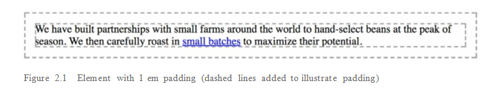

Mã để sản xuất  thứ này được hiển thị trong danh sách tiếp theo. Bộ quy tắc chỉ định kích thước phông chữ là 16 px, trở thành phần tử Định nghĩa cục bộ của thành phần 1 cho 1 em. Sau đó, mã sử dụng ems để chỉ định phần đệm của phần tử. Thêm phần này vào biểu định kiểu mới và đặt một số văn bản vào < div class = "padded"> để xem nó trong trình duyệt của bạn.

*listing 2.1 *

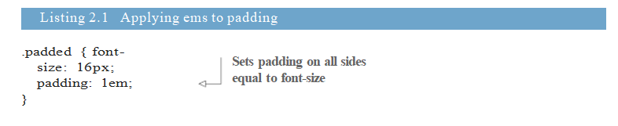

Phần đệm này có giá trị được chỉ định là 1em. Điều này được nhân với kích thước phông chữ, tạo ra phần đệm được hiển thị là 16 px. Điều này rất quan trọng: Các giá trị được khai báo sử dụng các đơn vị tương đối được trình duyệt đánh giá thành một giá trị tuyệt đối, được gọi là giá trị được tính toán.

Trong ví dụ này, chỉnh sửa phần đệm thành 2 em sẽ tạo ra giá trị được tính là 32 px. Nếu một bộ chọn khác nhắm vào cùng một phần tử và ghi đè lên nó bằng một cỡ chữ khác nhau, thì nó sẽ thay đổi ý nghĩa cục bộ của em và phần đệm được tính toán sẽ thay đổi để phản ánh điều đó.

Việc sử dụng ems có thể thuận tiện khi cài đặt các thuộc tính như đệm, chiều cao, chiều rộng hoặc bán kính đường viền vì các thuộc tính này sẽ chia tỷ lệ đồng đều với phần tử nếu nó thừa hưởng các kích thước phông chữ khác nhau hoặc nếu người dùng thay đổi cài đặt phông chữ.

Hình 2.2 cho thấy hai hộp có kích thước khác nhau. Kích thước phông chữ, phần đệm và đường viền
bán kính trong mỗi  TH không giống nhau.

*figure 2.2 *

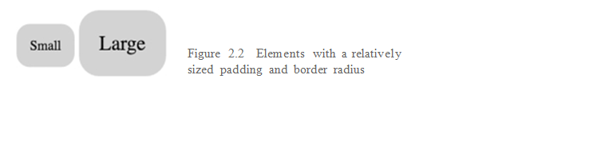

Trang 31 

Bạn có thể xác định kiểu cho các hộp này bằng cách chỉ định phần đệm và bán kính đường viền bằng cách sử dụng ems. Bằng cách cung cấp cho mỗi phần đệm và bán kính đường viền là 1 em, bạn có thể chỉ định một cỡ chữ khác nhau cho mỗi phần tử và các thuộc tính khác sẽ chia tỷ lệ cùng với phông chữ.

Trong HTML của bạn, tạo hai hộp như hiển thị tiếp theo. Thêm hộp nhỏ và hộp lớn các lớp cho từng cái tương ứng, như là sửa đổi kích thước

*listing 2.2 * 
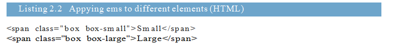

Bây giờ, thêm các kiểu được hiển thị bên cạnh biểu định kiểu của bạn. Điều này xác định một hộp bằng cách sử dụng ems. Nó cũng định nghĩa các sửa đổi nhỏ và lớn, mỗi bộ chỉ định một cỡ chữ khác nhau.

*listing 2.3 * 
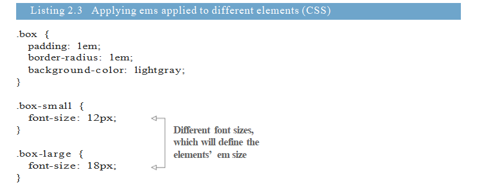

Đây là một tính năng mạnh mẽ của ems. Bạn có thể xác định kích thước của một phần tử và sau đó chia tỷ lệ toàn bộ lên hoặc xuống bằng một khai báo thay đổi kích thước phông chữ. Bạn có thể xây dựng một ví dụ khác về điều này, nhưng trước tiên, hãy để nói chuyện về kích thước phông chữ và phông chữ

## 2.2.1 Using ems to define font-size

Khi nói đến thuộc tính kích thước phông chữ, ems hành xử hơi khác một chút. Như tôi đã nói, ems được xác định bởi kích thước phông chữ hiện tại. Nhưng, nếu bạn khai báo cỡ chữ: 1.2em, điều đó có nghĩa là gì? Một cỡ chữ có thể lồng nhau bằng 1,2 lần chính nó. Thay vào đó, kích thước phông chữ có nguồn gốc từ kích thước phông chữ được kế thừa.

Để biết ví dụ cơ bản, xem hình 2.3. Điều này cho thấy hai bit văn bản, mỗi bit khác nhau cỡ chữ. Bạn có thể xác định những điều này bằng cách sử dụng ems trong danh sách 2.4.

*figure 2.3 * 

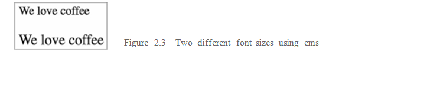

Thay đổi trang của bạn để phù hợp với danh sách sau đây. Dòng văn bản đầu tiên nằm trong thẻ < body>, do đó, nó sẽ hiển thị ở kích thước phông chữ phần thân . Phần thứ hai, khẩu hiệu, kế thừa cỡ chữ đó.

*listing 2.4 * 

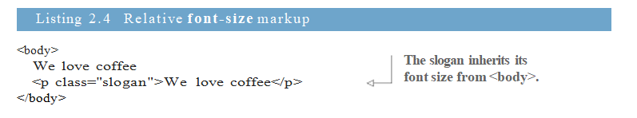

CSS trong danh sách tiếp theo chỉ định kích thước phông chữ cơ thể. Tôi đã sử dụng các pixel ở đây cho rõ ràng. Tiếp theo, bạn sẽ sử dụng ems để tăng kích thước của khẩu hiệu.

*listing 2.5 * 

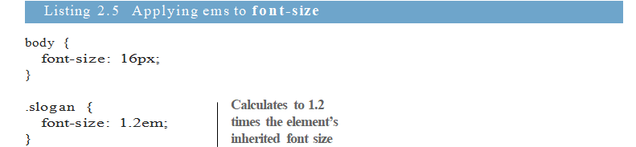

Kích thước phông chữ được chỉ định cho  slogan là 1,2 em. Để xác định giá trị pixel được tính toán, bạn sẽ cần tham khảo kích thước phông chữ được kế thừa là 16 px: 16 lần 1,2 bằng 19,2, vì vậy kích thước phông chữ được tính là 19,2 px.

TIP  Nếu bạn biết kích thước phông chữ dựa trên pixel mà bạn thích, nhưng muốn chỉ định
khai báo trong ems, ở đây, một công thức đơn giản: chia kích thước pixel mong muốn cho kích thước pixel gốc (được kế thừa). Ví dụ: nếu bạn muốn phông chữ 10 px và phần tử của bạn đang kế thừa phông chữ 12 px, 10/12 = 0.8333 em. Nếu bạn muốn một phông chữ 16 px và phông chữ mẹ là 12 px, 16/12 = 1.3333 em. Chúng tôi sẽ thực hiện việc tính toán này nhiều lần trong suốt chương này.

Nó rất hữu ích khi biết rằng, đối với hầu hết các trình duyệt, kích thước phông chữ mặc định là 16 px. Về mặt kỹ thuật, nó là gía trị từ khóa trung bình  tính đến 16 px.

 ### EMS FOR FONT SIZE TOGETHER WITH EMS FOR OTHER PROPERTIES

Bây giờ, bạn đã xác định quy tắc cho kích thước phông chữ (dựa trên kích thước phông chữ được kế thừa). Và, bạn đã xác định EMS cho các thuộc tính khác như đệm và bán kính đường viền (dựa trên kích thước phông chữ của phần tử thuê lại). Điều khiến ems khó sử dụng  là khi bạn sử dụng chúng cho cả cỡ chữ và bất kỳ thuộc tính nào khác trên cùng một phần tử. Khi bạn thực hiện việc này, trình duyệt phải tính toán kích thước phông chữ trước, sau đó nó sử dụng giá trị đó để tính các giá trị khác. Cả hai thuộc tính có thể có cùng một giá trị khai báo, nhưng chúng sẽ có các giá trị được đặt khác nhau.

Trong ví dụ trước, chúng tôi đã tính kích thước phông chữ là 19,2 px (kế thừa 16 px cỡ chữ gấp 1,2 em). Hình 2.4 cho thấy phần tử khẩu hiệu tương tự, nhưng được thêm vào

Trang 33 

(tiếp )  đệm 1,2 em và một nền màu xám để làm cho kích thước đệm rõ ràng hơn. Phần đệm này lớn hơn một chút so với kích thước phông chữ, mặc dù cả hai đều có cùng giá trị khai báo

*figure 2.4 * 

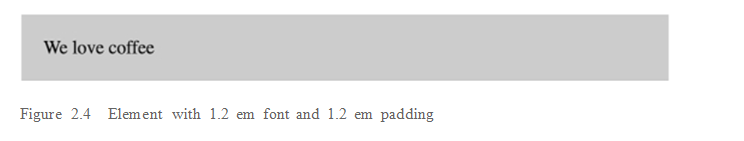

Điều xảy ra ở đây là đoạn văn thừa hưởng cỡ chữ 16 px từ phần thân, tạo ra cỡ chữ được tính là 19,2 px. Điều này có nghĩa là 19,2 px hiện là giá trị cục bộ cho một em và giá trị đó được sử dụng để tính toán phần đệm. CSS cho điều này được hiển thị tiếp theo. Cập nhật biểu định kiểu của bạn để thấy điều này trong trang thử nghiệm của bạn.

*listing 2.6 * 

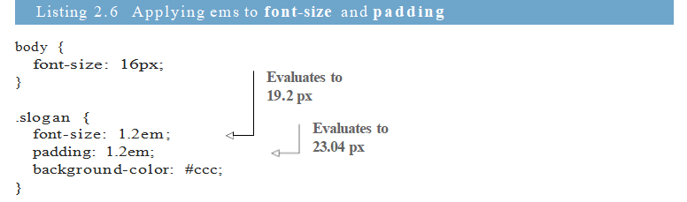
Trong ví dụ này, phần đệm có giá trị được chỉ định là 1,2 em. Điều này nhân với 19,2 px (kích thước phông chữ của phần tử hiện tại) tạo ra giá trị tính toán là 23,04 px. Mặc dù kích thước phông chữ và phần đệm có cùng giá trị được chỉ định, các giá trị được tính toán của chúng là khác nhau.

 ### THE SHRINKING FONT PROBLEM

Ems có thể tạo ra kết quả bất ngờ khi bạn sử dụng chúng để chỉ định kích thước phông chữ của nhiều yếu tố lồng nhau. Để biết giá trị chính xác cho từng thành phần, bạn sẽ cần phải biết kích thước phông chữ được kế thừa của nó, nếu được xác định trên thành phần chính trong ems, yêu cầu bạn phải biết kích thước được thừa kế của phần tử cha mẹ, v.v.

Điều này trở nên rõ ràng nhanh chóng khi bạn sử dụng ems cho kích thước phông chữ của danh sách và sau đó lồng danh sách dưới nhiều cấp độ . Hầu như mọi nhà phát triển web tại một số thời điểm trong sự nghiệp của họ tải trang của họ để tìm một cái gì đó giống như hình 2.5. Các văn bản đang thu hẹp! Đây chính xác là loại vấn đề khiến các nhà phát triển sợ hãi việc sử dụng ems.

*figure 2.5 * 

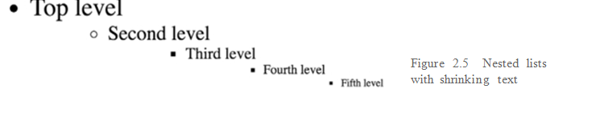
Trang 34

Thu hẹp văn bản xảy ra khi bạn lồng danh sách dưới nhiều cấp độ  và áp dụng kích thước phông chữ dựa trên em cho mỗi cấp độ. Listings   2.7 và 2.8 cung cấp một ví dụ về điều này bằng cách đặt kích thước phông chữ của các danh sách không có thứ tự thành .8 em. Công cụ chọn nhắm mọi <ul> trên trang; vì vậy khi các danh sách này kế thừa kích thước phông chữ của chúng từ các danh sách khác, ems hòa lẫn vs nhau .

*listing 2.7 * 

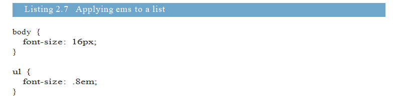

*listing 2.8 * 

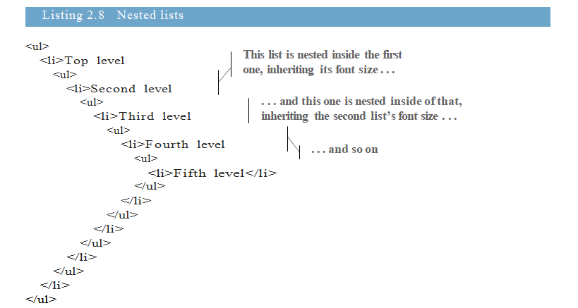

Mỗi danh sách có cỡ chữ  bằng 0,8 lần so với cha mẹ của nó. Điều này có nghĩa là danh sách đầu tiên có cỡ chữ là 12,8 px, nhưng danh sách tiếp theo xuống là 10,24 px (12,8 px × 0,8) và cấp độ thứ ba là 8,192 px, v.v. Tương tự, nếu bạn chỉ định kích thước lớn hơn 1 em, văn bản sẽ liên tục phát triển thay thế. Những gì chúng tôi muốn là chỉ định phông chữ ở cấp cao nhất, sau đó duy trì cùng kích thước phông chữ, như trong hình 2.6.

*figure 2.6 * 

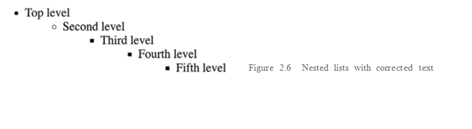

Trang 35

Một cách bạn có thể thực hiện điều này là với mã trong danh sách 2.9. Điều này đặt kích thước phông chữ của danh sách đầu tiên thành .8 em như trước (liệt kê 2.7). Bộ chọn thứ hai trong danh sách sau đó nhắm mục tiêu tất cả các danh sách không có thứ tự trong danh sách không có thứ tự - tất cả chúng ngoại trừ danh sách  cấp cao nhất. Các danh sách lồng nhau bây giờ có kích thước phông chữ bằng với cha mẹ của chúng, như trong hình 2.6.

*listing 2.6 * 

Điều này khắc phục vấn đề, mặc dù nó không lý tưởng; bạn có thể thiết lập một giá trị và sau đó ghi đè lên nó bằng một quy tắc khác. Sẽ tốt hơn nếu bạn có thể tránh các quy tắc ghi đè bằng cách làm tăng tính đặc hiệu của các công cụ chọn.

Đến bây giờ, rõ ràng rằng ems có thể tránh xa bạn nếu bạn ko cẩn thận  . Chúng rất đẹp cho phần đệm, lề và kích thước phần tử, nhưng khi nói đến kích thước phông chữ, chúng có thể trở nên phức tạp. Rất may, có một lựa chọn tốt hơn.

2.2.2 Using rems for font-size

Khi trình duyệt phân tích cú pháp một tài liệu HTML, nó sẽ tạo ra một đại diện trong bộ nhớ của tất cả các thành phần trên trang. Đại diện này được gọi là DOM (Mô hình đối tượng tài liệu). Nó có cấu trúc cây, trong đó mỗi phần tử được đại diện bởi một nút. Các Phần tử < html> là nút cấp cao nhất (hoặc gốc). Bên dưới nó là các nút con của nó, < head> và < body >. Và bên dưới đó là phần tử con , sau đó là các phần tử con , v.v.

Nút gốc là tổ tiên của tất cả các yếu tố khác trong tài liệu. Nó có một bộ chọn lớp giả đặc biệt (: root) mà bạn có thể sử dụng để nhắm mục tiêu nó. Điều này tương đương với việc sử dụng bộ chọn loại html với tính đặc hiệu của một lớp thay vì thẻ.

Rem là viết tắt của root em. Thay vì liên quan đến yếu tố hiện tại, rems lại liên quan đến yếu tố gốc. Bất kể bạn áp dụng nó ở đâu trong tài liệu, 1,2 rem có cùng giá trị được tính: 1,2 lần kích thước phông chữ của phần tử gốc. Danh sách sau đây thiết lập kích thước phông chữ gốc và sau đó sử dụng rems để xác định kích thước phông chữ cho các danh sách không có thứ tự liên quan đến điều đó

*listing 2.10 * 
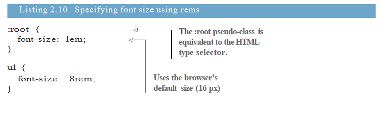
Trang 36 

Trong ví dụ này, kích thước phông chữ gốc là mặc định của trình duyệt là 16 px (một em trên phần tử gốc có liên quan đến mặc định của trình duyệt). Danh sách không có thứ tự có kích thước phông chữ được chỉ định là .8 rem, tính ra 12,8 px. Bởi vì điều này là liên quan đến gốc, kích thước phông chữ sẽ không đổi, ngay cả khi bạn lồng danh sách.

### Accessibility: use relative units for font size

Một số trình duyệt cung cấp hai cách để người dùng tùy chỉnh kích thước văn bản: thu phóng và kích thước phông chữ mặc định. Bằng cách nhấn Ctrl-plus (+) hoặc Ctrl-minus (-), người dùng có thể phóng to trang lên hoặc xuống. Điều này trực quan quy mô tất cả các phông chữ và hình ảnh và thường làm cho mọi thứ trên trang lớn hơn hoặc nhỏ hơn. Trong một số trình duyệt, thay đổi này chỉ được áp dụng cho tab hiện tại và là tạm thời, có nghĩa là nó không được chuyển sang các tab mới.

Đặt kích thước phông chữ mặc định là một chút khác nhau. Không chỉ khó tìm nơi đặt cái này (thường là trong trang cài đặt của trình duyệt), mà những thay đổi ở cấp độ này vẫn còn, cho đến khi người dùng quay lại và thay đổi giá trị một lần nữa. Điều hấp dẫn là cài đặt này không thay đổi kích thước phông chữ được xác định bằng pixel hoặc các đơn vị tuyệt đối khác. Vì kích thước phông chữ mặc định rất quan trọng đối với một số người dùng, đặc biệt là những người khiếm thị, bạn nên luôn chỉ định kích thước phông chữ với đơn vị hoặc tỷ lệ phần trăm tương đối.

Rems đơn giản hóa rất nhiều sự phức tạp liên quan đến ems. Trên thực tế, họ cung cấp một nền tảng trung gian tốt giữa các pixel và ems bằng cách cung cấp các lợi ích của các đơn vị tương đối, nhưng dễ làm việc hơn. Điều này có nghĩa là bạn nên sử dụng rems ở mọi nơi và từ bỏ các tùy chọn khác? Không.

Trong CSS, một lần nữa, câu trả lời thường là, nó tùy thuộc vào. Rems chỉ là một công cụ trong túi công cụ của bạn. Một phần quan trọng của việc thành thạo CSS là học khi nào nên sử dụng công cụ nào. Mặc định của tôi là sử dụng rems cho kích thước phông chữ, pixel cho viền và cho hầu hết các ứng dụng khác, đặc biệt là phần đệm, lề và bán kính đường viền (mặc dù tôi thích sử dụng phần trăm cho chiều rộng của container khi cần thiết).

Bằng cách này, kích thước phông chữ có thể dự đoán được, nhưng bạn sẽ vẫn có được sức mạnh của quy mô đệm và lề của bạn, nếu các yếu tố khác làm thay đổi kích thước phông chữ của một yếu tố. Pixels  có ý nghĩa đối với các đường viền, đặc biệt là khi bạn muốn có một đường kẻ đẹp. Đây là những đơn vị tiếp theo của tôi cho các thuộc tính khác nhau, nhưng một lần nữa, chúng là các công cụ, và trong một số trường hợp, một công cụ khác  có thể thực hiện công việc tốt hơn.

TIP Khi nghi ngờ, hãy sử dụng rems cho kích thước phông chữ, pixel cho viền và ems cho
hầu hết các thuộc tính khác. 

2.3 Stop thinking in pixels

Một  hình mẫu, hay đúng hơn là antipattern , đã phổ biến trong nhiều năm qua là đặt lại kích thước phông chữ ở trang gốc thành .625 em hoặc 62,5%.

Trang 37 

*listing 2.11 * 

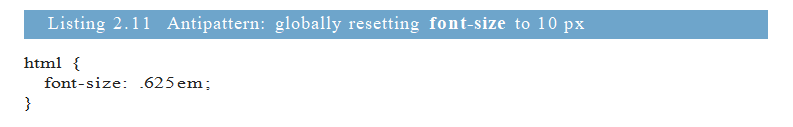

Tôi không khuyến khích bạn làm điều này . Nó sẽ đưa kích thước phông chữ mặc định của trình duyệt, 16 px và giảm xuống còn 10 px. Cách thực hành này đơn giản hóa toán học: Nếu nhà thiết kế của bạn yêu cầu bạn tạo phông chữ 14 px, bạn có thể dễ dàng chia 10 cho  phần đầu và gõ 1,4 rem, tất cả trong khi vẫn sử dụng các đơn vị tương đối.

Ban đầu, điều này có thể thuận tiện, nhưng có hai vấn đề với phương pháp này. Đầu tiên, nó buộc bạn phải viết rất nhiều kiểu trùng lặp. Mười pixel là quá nhỏ đối với hầu hết các văn bản, do đó, bạn sẽ phải ghi đè lên nó trên toàn trang. Bạn sẽ thấy mình thiết lập các biểu đồ thành 1,4 rem và thêm vào 1,4 rem và điều hướng các liên kết đến 1,4 rem, v.v. Điều này giới thiệu nhiều chỗ bị lỗi hơn, nhiều điểm liên lạc hơn trong mã của bạn khi cần thay đổi và tăng kích thước của biểu định kiểu của bạn.

Vấn đề thứ hai là khi bạn làm điều này, bạn vẫn đang suy nghĩ bằng pixel. Bạn có thể nhập 1,4 rem vào mã của mình, nhưng trong tâm trí của bạn, bạn vẫn đang suy nghĩ về 14 pixel. Trên một trang web trực tuyến , bạn sẽ cảm thấy thoải mái với các giá trị mờ mờ. Nó không quan trọng là có bao nhiêu pixel 1,2 em ước tính; tất cả những gì bạn cần biết là nó có kích thước lớn hơn một chút so với kích thước phông chữ được kế thừa. Và, nếu nó không giống như cách bạn muốn trên màn hình, hãy thay đổi nó. Điều này có một số thử nghiệm và lỗi, nhưng trong thực tế, do đó, làm việc với pixel. (Trong chương 13, chúng tôi sẽ xem xét các quy tắc cụ thể bổ sung để tinh chỉnh phương pháp này.)

Khi làm việc với ems, nó rất dễ bị nhầm lẫn  về chính xác có bao nhiêu pixel sẽ được  đánh giá, đặc biệt là kích thước phông chữ. Bạn sẽ tự làm mình điên loạn  và nhân giá trị em khi bạn đi. Thay vào đó, tôi thách bạn tập thói quen sử dụng ems trước. Nếu bạn đã quen với việc sử dụng pixel, sử dụng các giá trị em sẽ cần phải luyện tập , nhưng nó có giá trị.

Điều này không  có nghĩa là bạn sẽ không bao giờ phải làm việc với pixel. Nếu bạn làm việc với một nhà thiết kế, có lẽ bạn sẽ cần làm việc  với một số pixel cụ thể, và điều đó ổn. Khi bắt đầu một dự án, bạn sẽ cần thiết lập một kích thước phông chữ cơ bản (và thường là một vài kích thước phổ biến cho các tiêu đề và chú thích). Giá trị tuyệt đối dễ sử dụng hơn khi thảo luận về kích thước của sự vật.

Chuyển đổi sang rems sẽ liên quan đến số học, vì vậy hãy giữ một máy tính tiện dụng. (Tôi nhấn Command-Space trên máy Mac của mình và nhập phương trình vào Spotlight.) Đặt kích thước phông chữ gốc vào vị trí xác định một rem. Từ thời điểm đó, làm việc trong pixel phải là ngoại lệ, không phải là tiêu chuẩn.

Tôi sẽ tiếp tục đề cập đến các pixel trong suốt chương này. Điều này sẽ giúp tôi nhắc lại lý do tại sao các đơn vị tương đối hành xử theo cách họ làm, cũng như giúp bạn quen với việc tính toán của EMS. Sau chương này, tôi sẽ chủ yếu thảo luận về kích thước phông chữ bằng cách sử dụng các đơn vị tương đối.

Trang 38 

## 2.3.1 Setting a sane default font size

Hãy nói rằng bạn muốn kích thước phông chữ mặc định của bạn là 14 px. Thay vì đặt mặc định 10 px sau đó ghi đè lên toàn bộ trang, hãy đặt giá trị đó ở gốc. Giá trị mong muốn chia cho giá trị được thừa kế - trong trường hợp này, trình duyệt mặc định - là 14/16, bằng 0,875.

Thêm danh sách sau vào đầu biểu định kiểu mới, khi bạn sẽ xây dựng trên đó. Cái này đặt phông chữ mặc định ở gốc (< html>).

*listing 2.12 * 
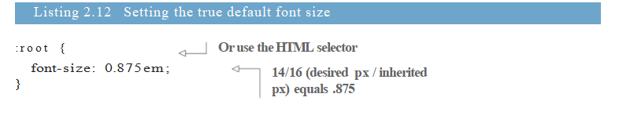
Bây giờ kích thước phông chữ mong muốn của bạn được áp dụng cho toàn bộ trang. Bạn  cần phải chỉ định nó ở nơi khác. Bạn chỉ cần thay đổi nó ở những nơi mà thiết kế lệch khỏi điều này, chẳng hạn như các tiêu đề.

Hãy tạo ra bảng điều khiển trong hình 2.7. Bạn sẽ xây dựng bảng điều khiển này dựa trên  cỡ chữ 14px, sử dụng các phép đo tương đối.

*figure 2.7 * 

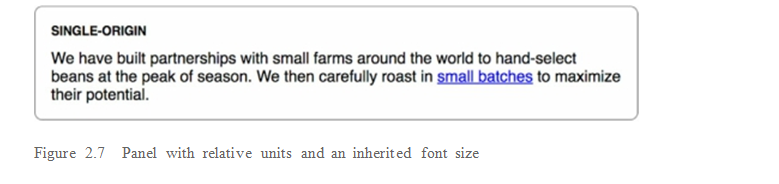

Đánh dấu cho điều này được hiển thị ở đây. Thêm điều này vào trang của bạn.

*listing 2.13 * 

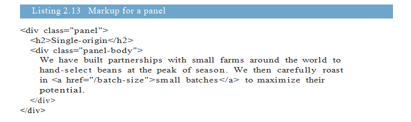

Danh sách tiếp theo cho thấy các kiểu  . Bạn sẽ  sử dụng ems cho phần đệm và bán kính đường viền, rem cho kích thước phông chữ của tiêu đề và px cho đường viền. Thêm chúng vào biểu định kiểu của bạn.

Trang 39 

*listing 2.14 * 

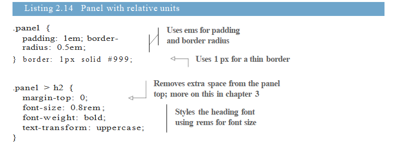

Mã này đặt một đường viền mỏng xung quanh bảng điều khiển và  kiểu tiêu đề. Tôi đã chọn  một tiêu đề nhỏ hơn, nhưng đậm và tất cả các chữ hoa. (Bạn có thể làm cho kiểu chữ này lớn hơn hoặc một kiểu chữ khác nếu thiết kế của bạn yêu cầu nó.)

> trong bộ chọn thứ hai là direct descendant combinator. Nó nhắm mục tiêu h2 là một phần tử con của phần tử .panel. Xem phụ lục A để tham khảo đầy đủ các bộ chọn và tổ hợp.

Trong danh sách 2.13, tôi đã thêm một lớp thân bảng vào phần chính của bảng để rõ ràng, nhưng bạn sẽ nhận thấy rằng bạn không cần phải sử dụng nó trong CSS của mình. Bởi vì phần tử này đã kế thừa kích thước phông chữ gốc, nó đã xuất hiện như cách  bạn muốn.

## 2.3.2 Making the panel responsive

Hãy xem xét điều này  một chút nữa. Bạn có thể sử dụng một số truy vấn phương tiện để thay đổi kích thước phông chữ cơ sở, tùy thuộc vào kích thước màn hình. Điều này sẽ làm cho bảng điều khiển kết xuất ở các kích thước khác nhau dựa trên kích thước của màn hình người dùng (hiển thị trong hình 2.8).

truy vấn phương tiện truyền thông  -  Một quy tắc @media được sử dụng để chỉ định các kiểu sẽ chỉ được áp dụng cho các kích thước màn hình hoặc loại phương tiện nhất định (ví dụ: in hoặc màn hình). Đây là một thành phần chính của thiết kế đáp ứng. Xem danh sách 2.15 để biết ví dụ; Tôi sẽ đề cập đến vấn đề này sâu hơn trong chương 8.

*figure 2.8 * 

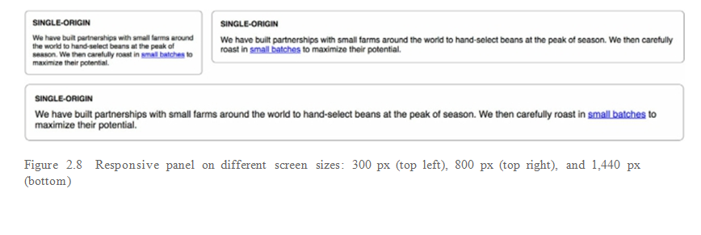

Trang 40 

Để xem kết quả này, hãy chỉnh sửa phần này trong biểu định kiểu của bạn để khớp với danh sách này.

*listing 2.15 * 

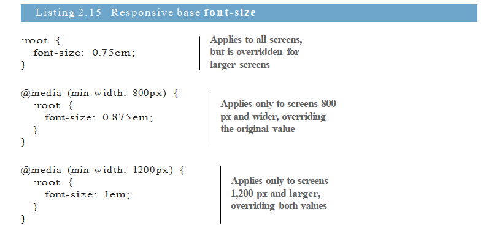

Quy tắc đầu tiên này chỉ định kích thước phông chữ mặc định nhỏ. Đây là kích thước phông chữ mà chúng tôi muốn áp dụng trên các màn hình nhỏ hơn. Sau đó, bạn đã sử dụng truy vấn phương tiện để ghi đè giá trị đó với kích thước phông chữ lớn hơn trên màn hình với chiều rộng từ 800 px và 1.200 px trở lên.

Bằng cách áp dụng các kích thước phông chữ này ở thư mục gốc trên trang của bạn, bạn đã xác định lại ý nghĩa của em và rem trong toàn bộ trang. Điều này có nghĩa là bảng điều khiển hiện đang phản hồi, mặc dù bạn không thực hiện thay đổi nào đối với bảng điều khiển. Trên màn hình nhỏ, chẳng hạn như điện thoại thông minh, phông chữ sẽ được hiển thị nhỏ hơn (12 px); tương tự như vậy, phần đệm và bán kính đường viền sẽ nhỏ hơn để phù hợp. Và, trên màn hình lớn hơn rộng hơn 800 px và 1.200 px, thành phần này có kích thước tương ứng với cỡ chữ 14 px và 16 px. Thay đổi kích thước cửa sổ trình duyệt của bạn để xem những thay đổi này diễn ra.

Nếu bạn đủ kỷ luật để tạo kiểu cho toàn bộ trang của mình theo các đơn vị tương đối như thế này, toàn bộ trang sẽ mở rộng lên xuống dựa trên kích thước khung nhìn. Đây có thể là một phần rất lớn trong chiến lược đáp ứng của bạn. Hai truy vấn phương tiện gần đầu biểu định kiểu của bạn có thể loại bỏ nhu cầu về hàng tá truy vấn phương tiện trong suốt phần còn lại của CSS. Nhưng nó không hoạt động nếu bạn xác định giá trị của mình bằng pixel.

Tương tự, nếu sếp hoặc khách hàng của bạn quyết định phông chữ trên trang web bạn xây dựng quá nhỏ hoặc quá lớn, bạn có thể thay đổi chúng trên toàn cầu chỉ bằng cách chạm vào một dòng mã. Thay đổi sẽ gợn qua phần còn lại của trang của bạn, dễ dàng.

2.3.3 Resizing a single component

Bạn cũng có thể sử dụng ems để chia tỷ lệ một thành phần riêng lẻ trên trang. Đôi khi bạn có thể cần một phiên bản lớn hơn của cùng một phần giao diện của mình trên một số phần nhất định của trang. Hãy để làm điều này với bảng điều khiển của chúng tôi. Bạn có thể thêm một lớp lớn vào bảng điều khiển: < div class = "panel Large">.

Trang 41 

Hình 2.9 cho thấy cả bảng bình thường và bảng lớn để so sánh. Hiệu ứng tương tự như bảng phản hồi, nhưng cả hai kích thước có thể được sử dụng đồng thời trên cùng một trang.

*figure 2.9 * 

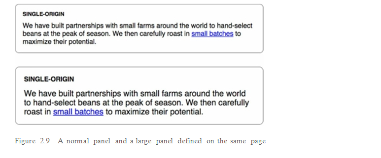

Hãy thực hiện một  thay đổi nhỏ theo cách bạn xác định kích thước phông chữ của bảng điều khiển. Bạn vẫn sẽ sử dụng các đơn vị tương đối, nhưng bạn sẽ điều chỉnh những gì  có liên quan. Đầu tiên, thêm kích thước phông chữ khai báo: 1rem vào phần tử cha của mỗi bảng. Điều này có nghĩa là mỗi bảng sẽ thiết lập một kích thước phông chữ có thể dự đoán được cho chính nó, bất kể nó được đặt ở đâu trên trang.

Thứ hai, xác định lại kích thước phông chữ Tiêu đề bằng cách sử dụng ems thay vì rems để làm cho nó tương ứng với kích thước phông chữ cha mẹ bạn vừa thiết lập ở 1 rem. Mã cho điều này là tiếp theo. Cập nhật biểu định kiểu của bạn để phù hợp.

*listing 2.16 * 
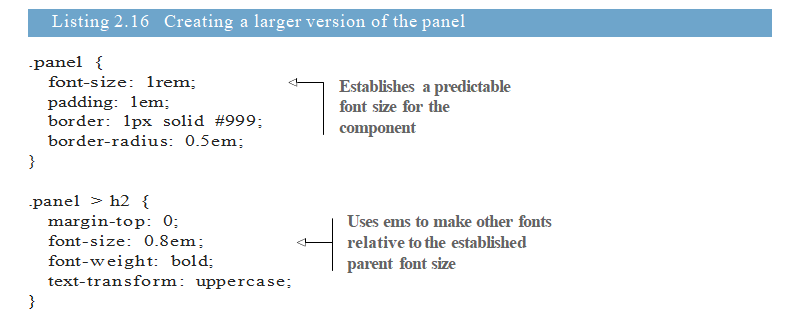
Thay đổi này không ảnh hưởng đến sự xuất hiện của bảng điều khiển, nhưng bây giờ nó sẽ thiết lập cho bạn để tạo phiên bản lớn hơn của bảng điều khiển với một dòng CSS duy nhất. Tất cả những gì bạn phải làm là ghi đè phần tử cha mẹ  bằng một rem với một  giá trị khác. Bởi vì tất cả các phép đo thành phần có liên quan đến điều này, ghi đè lên nó sẽ thay đổi kích thước toàn bộ bảng điều khiển. Thêm CSS trong danh sách tiếp theo vào biểu định kiểu của bạn để xác định phiên bản lớn hơn.

Trang 42

*listing 2.17 * 

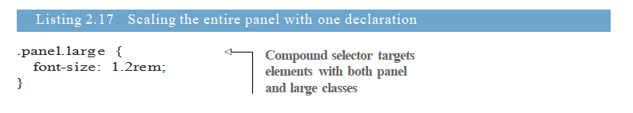

Bây giờ, bạn có thể sử dụng class = "panel" cho bảng thông thường và class = "panel large " cho bảng lớn hơn. Tương tự, bạn có thể xác định phiên bản nhỏ hơn của bảng điều khiển bằng cách đặt kích thước phông chữ nhỏ hơn. Nếu bảng điều khiển là một thành phần phức tạp hơn, với nhiều kích thước phông chữ hoặc phần đệm, nó vẫn chỉ lấy một tuyên bố này để thay đổi kích thước của nó, miễn là mọi thứ bên trong được xác định bằng cách sử dụng ems.

## 2.4 Viewport-relative units

Bạn đã học được rằng EMS và rems được định nghĩa liên quan đến kích thước phông chữ, nhưng những thứ  này  không chỉ là loại đơn vị tương đối duy nhất. Ngoài ra còn có các đơn vị liên quan đến chế độ xem để xác định độ dài liên quan đến chế độ xem của trình duyệt.

Viewport - Khu vực đóng khung trong cửa sổ trình duyệt nơi có thể nhìn thấy trang web. Điều này không bao gồm thanh địa chỉ, thanh công cụ và thanh trạng thái của trình duyệt, nếu có.

Nếu bạn không quen thuộc với các đơn vị liên quan đến khung nhìn, đây là một lời giải thích ngắn gọn.

+ vh - 1/100 chiều cao của khung nhìn
+ vw -  1/100 chiều rộng của khung nhìn
+ vmin -  1/100 của kích thước, chiều cao hoặc chiều rộng nhỏ hơn (IE9 hỗ trợ vm thay vì vmin)
+ vmax -  1/100 của kích thước, chiều cao hoặc chiều rộng lớn hơn (không được hỗ trợ trong IE hoặc, tại thời điểm viết, Edge)

Ví dụ: 50 vw bằng một nửa chiều rộng của khung nhìn và 25 vh bằng 25% chiều cao của khung nhìn. vmin dựa trên cái nào trong hai (chiều cao hoặc chiều rộng) nhỏ hơn. Điều này hữu ích để đảm bảo rằng một yếu tố sẽ phù hợp trên màn hình bất kể nguồn gốc của nó: Nếu màn hình nằm ngang, nó sẽ dựa trên chiều cao; nếu chân dung, nó dựa trên chiều rộng.

Hình 2.10 cho thấy một phần tử vuông như nó xuất hiện trong một số khung nhìn với các khung nhìn khác nhau kích thước màn hình. Nó được định nghĩa với cả chiều cao và chiều rộng 90 vmin, bằng 90% của kích thước nhỏ hơn trong hai chiều, 90% chiều cao trên màn hình ngang, hoặc 90% chiều rộng trên chân dung.

Liệt kê 2.18 hiển thị các kiểu cho phần tử này. Nó tạo ra một hình vuông lớn luôn vừa vặn trong khung nhìn cho dù trình duyệt có kích thước như thế nào. Bạn có thể thêm < div class = "vuông"> vào trang của mình để thấy điều này.

Trang 43 

*figure 2.10 * 

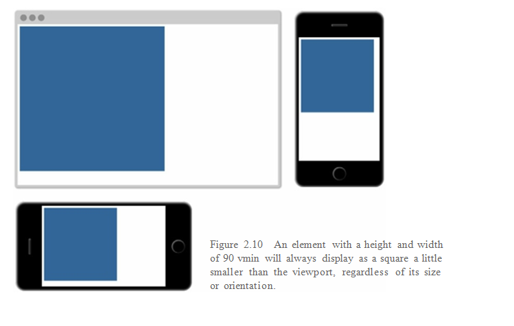

*listing 2.18 * 

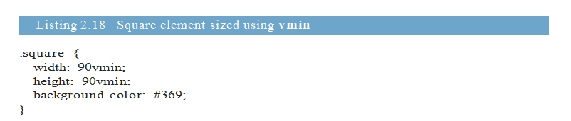

Độ dài tương đối của khung nhìn là tuyệt vời cho những thứ như làm cho hình ảnh anh hùng lớn lấp đầy màn hình. Hình ảnh của bạn có thể ở trong một thùng chứa dài, nhưng đặt chiều cao hình ảnh thành 100 vh, làm cho nó chính xác chiều cao của khung nhìn.

 CSS3

Một số loại đơn vị trong chương này ko nằm trong các phiên bản CSS trước đó (đặc biệt là các đơn vị tương đối và chế độ xem). Chúng được thêm vào giữa một loạt các thay đổi về ngôn ngữ, thường được gọi là CSS3.

Vào cuối những năm 1990 và đầu những năm 2000, sau khi làm việc ban đầu về đặc tả CSS, rất ít thay đổi trong một thời gian dài. W3C (World Wide Web Consortium) đã xuất bản CSS

Trang 44

(tiếp ) 2 đặc tả vào tháng 5 năm 1998. Ngay sau đó, công việc đã bắt đầu trên phiên bản 2.1 để sửa các vấn đề và lỗi trong phiên bản 2. Công việc trên CSS 2.1 tiếp tục trong nhiều năm, với một vài bổ sung đáng kể cho ngôn ngữ. Nó không được hoàn thiện như là một Khuyến nghị được đề xuất cho đến tháng 4 năm 2011. Đến thời điểm này, các trình duyệt đã thực hiện hầu hết các thay đổi CSS 2.1 và đang trên đường bổ sung các tính năng mới hơn theo CSS3 đơn sắc.

Số 3  là một số phiên bản không chính thức; không có đặc điểm kỹ thuật CSS3. Thay vào đó, đặc tả được chia thành các mô-đun riêng lẻ, mỗi mô-đun độc lập. Các đặc điểm kỹ thuật cho nền và đường viền hiện tách biệt với mô hình cho các mô hình hộp và với mô hình xếp tầng và kế thừa. Điều này cho phép W3C thực hiện các sửa đổi mới cho một khu vực CSS mà không cần cập nhật các khu vực không cần thiết không thay đổi. Nhiều trong số các thông số kỹ thuật này vẫn còn ở phiên bản 3 (bây giờ được gọi là cấp độ 3), nhưng một số, chẳng hạn như thông số kỹ thuật của bộ chọn, ở cấp 4 và một số khác, chẳng hạn như flexbox, ở cấp 1.

Khi những thay đổi này được giới thiệu, chúng tôi đã thấy sự bùng nổ của các tính năng mới được tung ra trong các trình duyệt từ năm 2009 đến 2013. Các bổ sung đáng chú ý tại thời điểm này bao gồm các đơn vị rems và khung nhìn, cũng như các bộ chọn mới, truy vấn phương tiện, phông chữ web, viền tròn, hình ảnh động, chuyển tiếp, biến đổi và các cách khác nhau để chỉ định màu sắc. Và, các tính năng mới đang dần xuất hiện mỗi năm.

Điều này có nghĩa là chúng tôi không còn làm việc với một phiên bản CSS cụ thể. Nó có một mức sống. Mỗi trình duyệt liên tục bổ sung hỗ trợ cho các tính năng mới. Các nhà phát triển làm việc với những thay đổi đó và thích nghi với chúng. Đây có lẽ ko phải là một CSS4, ngoại trừ có lẽ là một thuật ngữ tiếp thị chung chung hơn. Mặc dù cuốn sách này đề cập đến các tính năng CSS3, nhưng tôi không nhất thiết phải gọi chúng ra như vậy bởi vì, theo như liên quan đến web, thì nó có tất cả CSS.

## 2.4.1 Using vw for font size

Một ứng dụng cho các đơn vị tương đối quan sát có thể không rõ ràng ngay lập tức là kích thước phông chữ. Trong thực tế, tôi thấy việc sử dụng này thực tế hơn là áp dụng vh và vw cho chiều cao hoặc chiều rộng của phần tử.

Xem xét những gì sẽ xảy ra nếu bạn áp dụng kích thước phông chữ: 2vw cho một yếu tố. Trên màn hình máy tính để bàn ở mức 1.200 px, con số này ước tính là 24 px (2% của 1.200). Trên một máy tính bảng có chiều rộng màn hình 768 px, nó ước tính khoảng 15 px (2% của 768). Và, điều tốt đẹp là, các yếu tố quy mô trơn tru giữa hai kích thước. Điều này có nghĩa là không có sự thay đổi điểm dừng đột ngột; nó chuyển tiếp tăng dần khi kích thước khung nhìn thay đổi.

Thật không may, 24 px là một chút quá lớn trên một màn hình lớn. Và tệ hơn nữa, nó giảm xuống còn 7,5 px trên iPhone 6. Điều gì sẽ tốt hơn là hiệu ứng mở rộng này, nhưng với các thái cực ít nghiêm trọng hơn một chút. Bạn có thể đạt được điều này với hàm CSS calc()

2.4.2 Using calc() for font size

àm calc () cho phép bạn thực hiện thao tác  số học cơ bản với hai hoặc nhiều giá trị. Điều này đặc biệt hữu ích để kết hợp các giá trị được đo bằng các đơn vị khác nhau. Chức năng này hỗ trợ phép cộng (+), phép trừ (-), phép nhân (*) và phép chia (/). Các

Trang 45

(tiếp ) toán tử cộng và trừ phải được bao quanh bởi khoảng trắng, vì vậy tôi khuyên bạn nên tập thói quen luôn thêm khoảng trắng trước và sau mỗi toán tử; cho bài kiểm tra, calc (1em + 10px).

Bạn có thể sử dụng calc () trong danh sách tiếp theo để kết hợp các đơn vị với các đơn vị vw. Xóa kích thước phông chữ cơ sở trước đó (và các truy vấn phương tiện có liên quan) khỏi biểu định kiểu của bạn. Thêm cái này vào vị trí của nó

*listing 2.19 * 

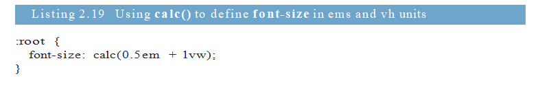

Bây giờ, mở trang và từ từ thay đổi kích thước trình duyệt của bạn. Bạn sẽ thấy tỷ lệ phông chữ trơn tru như bạn làm. 0,5 em ở đây hoạt động như một loại kích thước phông chữ tối thiểu và 1 vw thêm vô hướng đáp ứng. Điều này sẽ cung cấp cho bạn một kích thước phông chữ cơ bản tỷ lệ từ 11,75 px trên iPhone 6 lên đến 20 px trong cửa sổ trình duyệt 1.200 px. Bạn có thể điều chỉnh các giá trị này theo ý thích của bạn.

Bây giờ, bạn đã hoàn thành một phần lớn chiến lược đáp ứng của mình mà không cần một truy vấn phương tiện nào. Thay vì ba hoặc bốn điểm dừng được mã hóa cứng, mọi thứ trên trang của bạn sẽ mở rộng một cách trôi chảy theo chế độ xem.

## 2.5 Unitless numbers and line-height

Một số thuộc tính cho phép các giá trị đơn vị (nghĩa là một số không có đơn vị được chỉ định). Các thuộc tính hỗ trợ điều này bao gồm chiều cao dòng, chỉ số z và trọng lượng phông chữ (700 tương đương với đậm; 400 tương đương với bình thường, v.v.). Bạn cũng có thể sử dụng giá trị 0 đơn vị 0 bất cứ nơi nào một đơn vị độ dài (chẳng hạn như px, em hoặc rem) là bắt buộc vì trong những trường hợp này, đơn vị không quan trọng đối với 0 0 px bằng 0% bằng 0 em.

WARNING   đơn vị 0 chỉ có thể được sử dụng cho các giá trị độ dài và tỷ lệ phần trăm,
chẳng hạn như trong paddings, biên giới và chiều rộng. Nó có thể được sử dụng cho các giá trị góc, chẳng hạn như độ hoặc giá trị dựa trên thời gian như giây.

Thuộc tính chiều cao dòng là bất thường ở chỗ nó chấp nhận cả giá trị đơn vị và đơn vị. Thông thường bạn nên sử dụng các số đơn vị vì chúng được thừa kế khác nhau. Hãy để cuốn văn bản vào trang và xem cách ứng xử này. Thêm mã trong danh sách sau vào biểu định kiểu của bạn.

*listing 2.20 * 

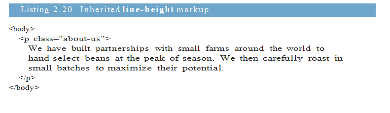

Trang 46 

Bạn sẽ  chỉ định chiều cao dòng cho phần tử cơ thể và cho phép nó được kế thừa bởi phần còn lại của tài liệu. Điều này sẽ hoạt động như mong đợi, bất kể bạn làm gì với kích thước phông chữ trong trang (hình 2.11).

*figure 2.11 * 

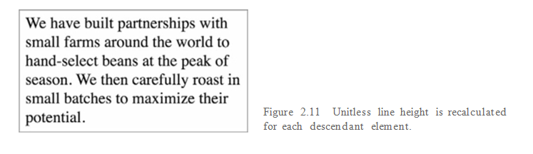

Thêm danh sách 2.21 vào biểu định kiểu của bạn cho các kiểu này. Đoạn văn thừa hưởng chiều cao dòng 1,2. Vì kích thước phông chữ là 32 px (2 em × 16 px, mặc định của trình duyệt), chiều cao của dòng được tính cục bộ là 38,4 px (32 px × 1,2). Điều này sẽ để lại một khoảng trống thích hợp giữa các dòng văn bản.

*listing 2.21 * 

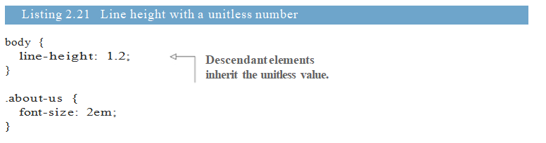

Nếu thay vào đó, bạn chỉ định chiều cao dòng bằng một đơn vị, bạn có thể gặp kết quả không mong muốn, giống như trong hình 2.12. Các dòng văn bản chồng chéo lẫn nhau. Liệt kê 2.22 cho thấy CSS đã tạo ra sự chồng lấp.

*figure 2.12 * 

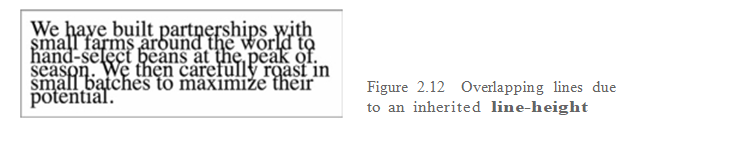

*listing 2.22* 

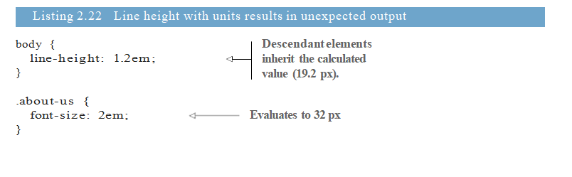

Trang 47 

Những kết quả này là do một sự kế thừa đặc biệt: khi một phần tử có giá trị được xác định bằng cách sử dụng độ dài (px, em, rem, v.v.), giá trị tính toán của nó được kế thừa bởi các phần tử con. Khi các đơn vị như ems được chỉ định cho chiều cao của dòng, giá trị của chúng được tính và giá trị được tính đó được truyền lại cho bất kỳ  phần tử con kế thừa nào. Với thuộc tính chiều cao dòng, điều này có thể gây ra kết quả không mong muốn nếu phần tử con có kích thước phông chữ khác nhau, giống như văn bản chồng chéo.

Length -  Tên chính thức cho một giá trị CSS biểu thị một thước đo khoảng cách. Nó có một số theo sau là một đơn vị, chẳng hạn như 5 px. Chiều dài có hai trạng thái : tuyệt đối và tương đối. Tỷ lệ phần trăm tương tự như độ dài, nhưng nói đúng ra, chúng không được coi là độ dài.

Khi bạn sử dụng một số không có đơn vị, giá trị khai báo đó được kế thừa, nghĩa là giá trị đã đặt của nó được tính toán lại cho mỗi phần tử con kế thừa. Điều này sẽ luôn luôn là kết quả bạn muốn. Sử dụng một số đơn vị cho phép bạn đặt chiều cao của dòng trên  phần thân và sau đó quên nó cho phần còn lại của trang, trừ khi có những nơi cụ thể mà bạn muốn tạo ngoại lệ.

## 2.6 Custom properties (aka CSS variables)

Vào năm 2015, một đặc tả CSS được chờ đợi từ lâu có tiêu đề Custom Properties for Cascading Vari- ables  đã được xuất bản dưới dạng Khuyến nghị của ứng viên. Thông số kỹ thuật này đã đưa ra khái niệm về các biến cho ngôn ngữ, cho phép một cấp độ mới của các kiểu dựa trên ngữ cảnh, động. Bạn có thể khai báo một biến và gán cho nó một giá trị; sau đó bạn có thể tham chiếu giá trị này trong suốt biểu định kiểu của bạn. Bạn có thể sử dụng điều này để giảm sự lặp lại trong biểu định kiểu của mình, cũng như một số ứng dụng có lợi khác mà bạn sẽ thấy ngay sau đây.

LƯU Ý Nếu bạn tình cờ sử dụng bộ tiền xử lý CSS hỗ trợ các biến của chính nó, chẳng hạn như Sass (bảng định kiểu tuyệt vời về mặt cú pháp) hoặc Less , bạn có thể bỏ qua các biến CSS. Đừng. Các biến CSS mới có bản chất khác nhau và linh hoạt hơn nhiều so với bất kỳ thứ gì mà bộ tiền xử lý có thể thực hiện. Tôi có xu hướng gọi chúng là các thuộc tính tùy chỉnh của người dùng, chứ không phải là các biến thể để nhấn mạnh sự khác biệt này.

Để xác định một thuộc tính tùy chỉnh, bạn khai báo nó giống như bất kỳ thuộc tính CSS nào khác. Liệt kê 2.23 là một ví dụ về khai báo biến. Bắt đầu một trang mới và biểu định kiểu và thêm CSS này vào .

Trang 48 

*listing 2.23 * 

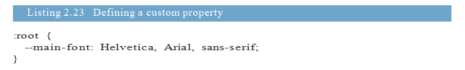

Danh sách này xác định một biến có tên --main-font và đặt giá trị của nó thành một tập hợp các phông chữ sans-serif phổ biến . Tên phải bắt đầu bằng hai dấu gạch nối (--) để phân biệt với các thuộc tính CSS, theo sau là bất kỳ tên nào bạn muốn sử dụng.

Các biến phải được khai báo bên trong một khối khai báo. Tôi đã sử dụng bộ chọn gốc: ở đây, nó đặt biến cho toàn bộ trang. Tôi sẽ giải thích điều này ngay sau đây.

Chính nó, khai báo biến này không làm gì cho đến khi chúng ta sử dụng nó. Hãy để ứng dụng này
đến một đoạn để tạo ra một kết quả như thế trong hình 2.13.

*figure 2.13 * 

Một hàm được gọi là var () cho phép sử dụng các biến. Bạn có thể sử dụng chức năng này để tham chiếu biến --main-font vừa được xác định. Thêm quy tắc hiển thị trong danh sách sau để đặt biến cần sử dụng.

*listing 2.24 * 

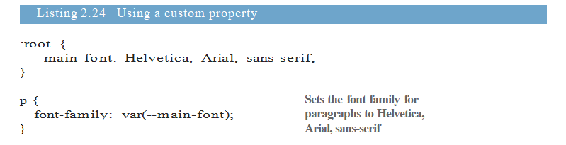

Các thuộc tính tùy chỉnh cho phép bạn xác định một giá trị ở một nơi, như là một nguồn sự thật duy nhất, và sử dụng lại giá trị đó trong suốt biểu định kiểu. Điều này đặc biệt hữu ích cho các giá trị định kỳ như màu sắc. Danh sách tiếp theo thêm một thuộc tính tùy chỉnh màu thương hiệu. Bạn có thể sử dụng biến này hàng chục lần trong suốt biểu định kiểu của mình, nhưng nếu bạn muốn thay đổi nó, bạn chỉ phải chỉnh sửa nó ở một nơi.

*listing 2.25 *

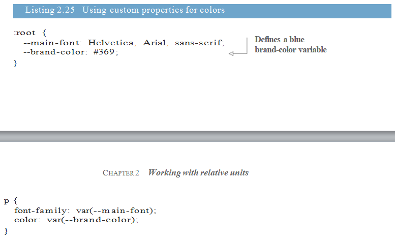

Trang 49 

Hàm var () chấp nhận tham số thứ hai, xác định giá trị dự phòng. Nếu biến được chỉ định trong tham số đầu tiên không được xác định, thì giá trị thứ hai được sử dụng thay thế.

* listing 2.26 * 

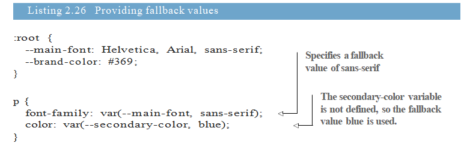

Danh sách này chỉ định giá trị dự phòng trong hai khai báo khác nhau. Trong lần đầu tiên, --main-font được định nghĩa là Helvetica, Arial, sans-serif, vì vậy giá trị này được sử dụng. Trong lần thứ hai, màu thứ hai là một biến không xác định, do đó, giá trị dự phòng màu xanh được sử dụng.

LƯU Ý Nếu hàm var () ước tính thành giá trị không hợp lệ, thuộc tính sẽ được đặt thành giá trị ban đầu. Ví dụ: nếu biến trong phần đệm: var (- brand -color) ước tính thành màu, thì đó sẽ là giá trị đệm không hợp lệ. Trong trường hợp đó, phần đệm sẽ được đặt thành 0 thay thế.

## 2.6.1 Changing custom properties dynamically

Trong các ví dụ  từ trước cho đến nay, các thuộc tính tùy chỉnh rất thuận tiện ; chúng  có thể giúp bạn  khỏi rất nhiều sự lặp lại trong mã của bạn. Nhưng điều khiến chúng đặc biệt  được quan tâm là việc khai báo các thuộc tính tùy chỉnh theo tầng và kế thừa: Bạn có thể xác định cùng một biến trong nhiều bộ chọn và biến sẽ có giá trị khác nhau cho các phần khác nhau của trang.

Bạn có thể định nghĩa một biến là màu đen, ví dụ, và sau đó xác định lại nó là màu trắng bên trong một thùng chứa cụ thể. Sau đó, bất kỳ kiểu nào dựa trên biến đó sẽ tự động chuyển sang màu đen nếu chúng ở bên ngoài vùng chứa và chuyển sang màu trắng nếu bên trong. Hãy sử dụng điều này để đạt được kết quả như trong hình 2.14.

Bảng này tương tự như bảng bạn đã thấy trước đó (hình 2.7). HTML cho điều này được hiển thị trong danh sách 2.27. Nó có hai phiên bản của bảng điều khiển: một bên trong cơ thể và một bên trong một phần tối. Cập nhật HTML của bạn để phù hợp với điều này.

Trang 50 

*figure 2.14 * 

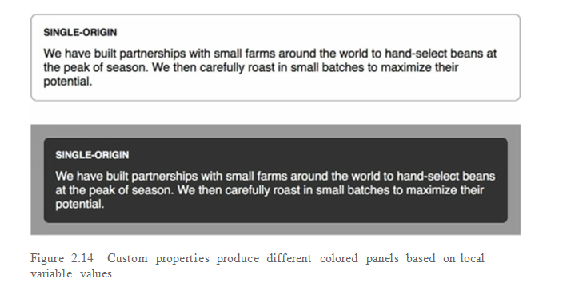

* listing 2.17 * 

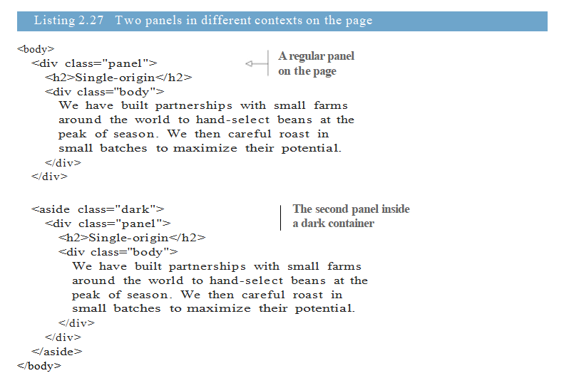

Hãy  xác định lại bảng điều khiển để sử dụng các biến cho văn bản và màu nền. Thêm danh sách tiếp theo vào biểu định kiểu của bạn. Điều này đặt màu nền thành màu trắng và văn bản thành màu đen. Tôi sẽ  giải thích cách thức hoạt động trước khi bạn thêm kiểu cho biến thể tối.

Trang 51 

*listing 2.28 * 

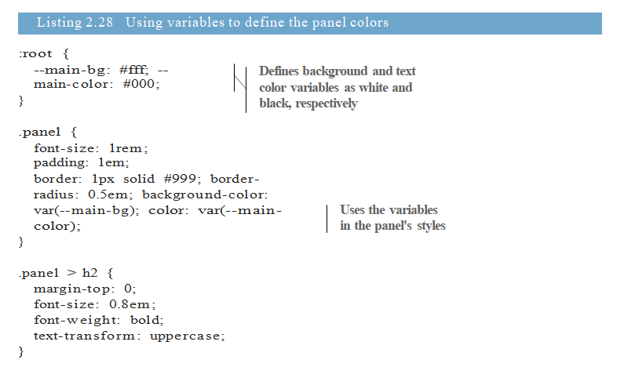
Một lần nữa, bạn đã xác định các biến trong một bộ quy tắc với bộ chọn: root. Điều này rất quan trọng vì nó có nghĩa là các giá trị này được đặt cho mọi thứ trong phần tử gốc (toàn bộ trang). Khi một phần tử con của gốc sử dụng các biến, đây là những giá trị mà chúng sẽ giải quyết.

Bạn có hai bảng, nhưng chúng vẫn trông giống nhau. Bây giờ, hãy  định nghĩa lại các biến, nhưng lần này với một bộ chọn khác. Danh sách tiếp theo cung cấp các kiểu cho  dark container . Nó đặt nền màu xám đậm trên thùng chứa, cũng như một chút đệm và lề. Nó cũng xác định lại cả hai biến. Thêm phần này vào biểu định kiểu của bạn.

*listing 2.29 * 

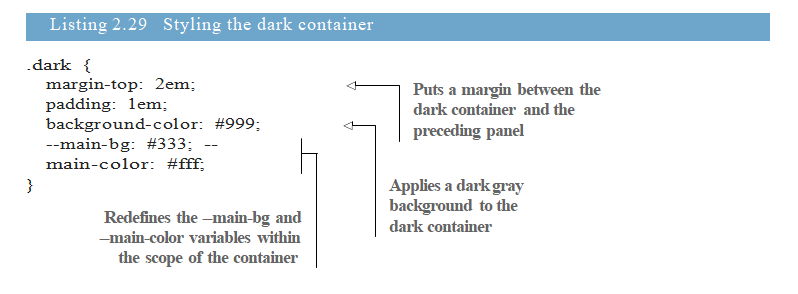

Tải lại trang và bảng thứ hai sẽ có nền tối và văn bản màu trắng. Điều này là do khi bảng điều khiển sử dụng các biến này, họ sẽ giải quyết các giá trị được xác định trên vùng chứa tối hơn là trên thư mục gốc. Lưu ý rằng bạn đã không phải sắp xếp lại bảng điều khiển hoặc áp dụng bất kỳ lớp bổ sung nào.

Trang 52 

Trong ví dụ này, bạn đã xác định các thuộc tính tùy chỉnh hai lần: lần đầu tiên ở gốc (trong đó - màu chính là màu đen), sau đó trên vùng chứa tối (trong đó - màu chính là màu trắng). Các thuộc tính tùy chỉnh hoạt động như một loại biến có phạm vi bởi vì các giá trị được kế thừa bởi các phần tử con cháu. Bên trong thùng chứa tối, - màu chính là màu trắng; Ở nơi khác trên trang, nó màu đen.

## 2.6.2 Changing custom properties with JavaScript

Thuộc tính tùy chỉnh cũng có thể được truy cập và thao tác trực tiếp trong trình duyệt bằng JavaScript. Bởi vì đây không phải là một cuốn sách về JavaScript, nên tôi sẽ cho bạn thấy đủ để làm quen với khái niệm này. Tôi sẽ để lại cho bạn để tích hợp nó vào các dự án JavaScript của bạn.

Danh sách sau đây cho thấy cách truy cập một thuộc tính trên một phần tử. Nó thêm một tập lệnh vào trang, ghi lại giá trị của phần tử gốc thuộc tính -- main-bg.

*listing 2.30 * 

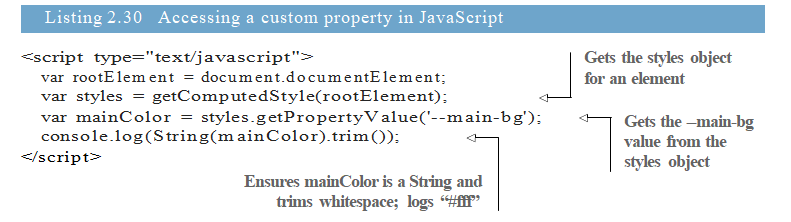

Vì bạn có thể chỉ định các giá trị mới cho các thuộc tính tùy chỉnh một cách nhanh chóng, bạn có thể sử dụng Java- Script để đặt giá trị mới cho --main-bg một cách linh hoạt. Nếu bạn đặt nó thành màu xanh nhạt, nó sẽ xuất hiện như thể hiện trong hình 2.15.

*figure 2.15 * 

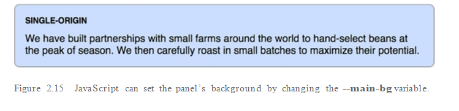

Mã trong danh sách tiếp theo đặt giá trị mới thành --main-bg trên phần tử gốc. Thêm phần này vào cuối thẻ < script>.

*listing 2.31 * 

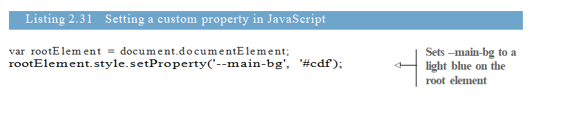

Trang 53 

Nếu bạn chạy tập lệnh này, mọi phần tử kế thừa thuộc tính --main-bg sẽ cập nhật để sử dụng giá trị mới này. Trên trang của bạn, điều này thay đổi nền của bảng đầu tiên thành màu xanh nhạt. Bảng điều khiển thứ hai vẫn không thay đổi, vì nó vẫn kế thừa tài sản từ thùng chứa tối.

Với kỹ thuật này, bạn có thể sử dụng JavaScript để tái tạo chủ đề trang web của mình, trực tiếp trên trình duyệt. Hoặc, bạn có thể đánh dấu một số phần nhất định của trang hoặc thực hiện bất kỳ số lượng thay đổi nhanh chóng nào khác. Chỉ sử dụng một vài dòng JavaScript, bạn có thể thực hiện các thay đổi mà sẽ  ảnh hưởng đến một số lượng lớn các yếu tố trên trang.

## 2.6.3 Experimenting with custom properties

Thuộc tính tùy chỉnh là một lĩnh vực hoàn toàn mới của CSS mà các nhà phát triển mới bắt đầu khám phá. Bởi vì sự hỗ trợ của trình duyệt đã bị hạn chế, nên nó vẫn chưa thấy sử dụng nhiều thời gian chính thức. Tôi chắc chắn rằng theo thời gian, bạn sẽ thấy các thực nghiệm  tốt nhất và sự tiếp cận với cách sử dụng  xuất hiện. Đây là một thứ mà bạn cần chú ý . Thử nghiệm với các thuộc tính tùy chỉnh và xem những gì bạn có thể đưa ra.
Xin lưu ý rằng mọi khai báo sử dụng var () sẽ bị bỏ qua bởi các trình duyệt cũ không hiểu nó. Cung cấp hành vi dự phòng cho các trình duyệt đó khi có thể:

Color: black;

Color: var(--main-color);

Summary

 + Hãy kết hợp việc sử dụng các đơn vị tương đối, cho phép cấu trúc Trang xác định ý nghĩa của các kiểu của bạn.

 + Hãy tận dụng việc sử dụng rems cho kích thước phông chữ, nhưng sử dụng có chọn lọc đối với quy mô đơn giản của các thành phần trên trang.

 + Bạn có thể thực hiện  trên quy mô toàn bộ trang của mình một cách nhanh chóng mà không cần bất kỳ truy vấn phương tiện nào.

 + Sử dụng các giá trị đơn vị khi chỉ định chiều cao dòng.

 + Bạn có thể bắt đầu làm quen với một trong những tính năng mới nhất, thuộc tính tùy chỉnh của CSS.

