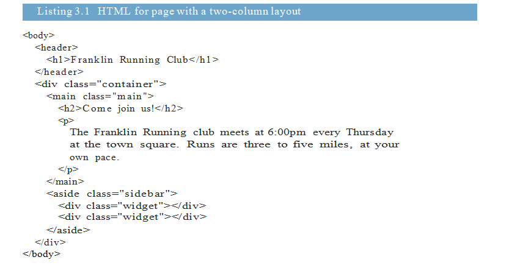
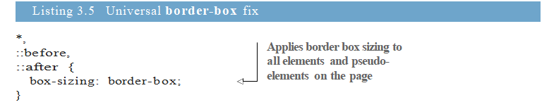
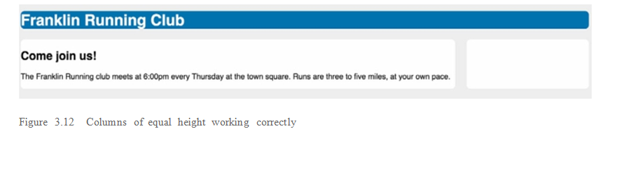
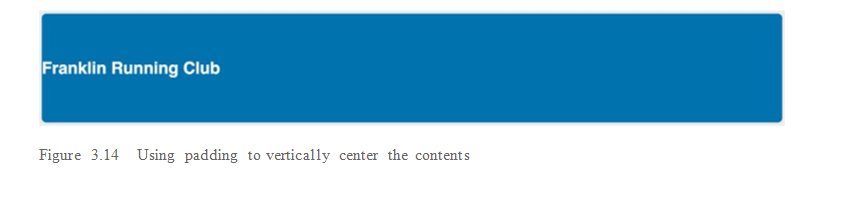
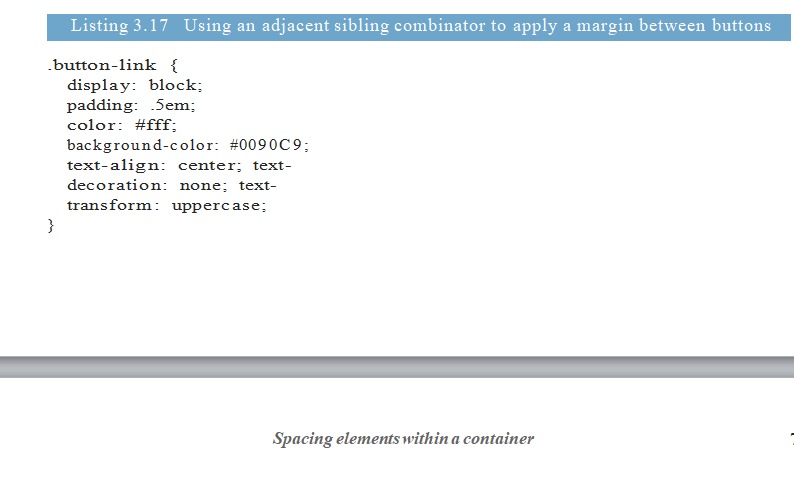

# Mastering the box model

Khi nói đến việc đặt ra các yếu tố trên trang, bạn sẽ tìm thấy rất nhiều điều đang diễn ra. Trên một trang web phức tạp, bạn có thể có các số float, các phần tử được định vị tuyệt đối và các phần tử khác có kích thước khác nhau. Bạn cũng có thể có một số bố cục sử dụng các cấu trúc CSS mới hơn, chẳng hạn như flexbox hoặc bố cục lưới. Bạn có rất nhiều thứ để theo dõi, và học mọi thứ liên quan đến bố cục có thể là quá sức.

Chúng tôi sẽ dành nhiều chương để xem xét kỹ một số kỹ thuật  về bố cục. Trước khi chúng ta đến với những điều đó, điều quan trọng là phải nắm vững các nguyên tắc cơ bản về các yếu tố kích thước và vị trí trình duyệt. Các chủ đề nâng cao hơn của bố cục được xây dựng trên các khái niệm như luồng tài liệu và mô hình hộp; đây là các quy tắc cơ bản xác định vị trí và kích thước của các yếu tố trên trang.

Trong chương này, bạn sẽ xây dựng bố cục trang hai cột. Bạn có thể quen thuộc với nó như  là một bài tập dành cho người mới bắt đầu CSS, nhưng tôi sẽ hướng dẫn bạn thực hiện theo cách

Trang 55

(tieps ) làm nổi bật một số sắc thái thường bị bỏ qua của bố cục. Chúng tôi sẽ xem xét một số trường hợp cạnh của mô hình hộp và tôi sẽ cho bạn lời khuyên thiết thực để định cỡ và sắp xếp các phần tử. Chúng tôi cũng sẽ giải quyết hai vấn đề nổi bật nhất trong CSS: cột dọc và cột có chiều cao bằng nhau.

## 3.1 Difficulties with element width

Trong chương này, bạn sẽ xây dựng một trang đơn giản với tiêu đề ở trên cùng và hai cột bên dưới. Đến cuối chương, trang của bạn sẽ trông giống như trong hình 3.1. Tôi cố tình làm cho thiết kế trang có một chút  hình khối, nên bạn có thể dễ dàng thấy kích thước và vị trí của tất cả các yếu tố.

*figure 3.1 *

Bắt đầu một trang mới và một bản định kiểu trống, sau đó liên kết chúng. Thêm đánh dấu hiển thị bên cạnh trang của bạn. Trang của bạn sẽ có một tiêu đề, cũng như một yếu tố chính và một yếu tố thanh bên sẽ tạo nên hai cột trên trang của bạn. Một container kết thúc hai cột.

*listing 3.1 * 

Trang 56

Hãy bắt đầu với một số phong cách rõ ràng. Bạn sẽ  đặt phông chữ cho trang, sau đó tô màu nền cho trang và từng thùng chứa chính. Điều này sẽ giúp bạn thấy vị trí và kích thước của mỗi yếu tố  khi bạn làm . Sau khi bạn làm điều này, trang của bạn sẽ trông giống như trong hình 3.2.

*figure 3.2 *

Đối với một số thiết kế trang web, màu nền của một số container có thể là màu trong suốt. Khi gặp trường hợp này, có thể hữu ích khi tạm thời áp dụng màu nền cho thùng chứa cho đến khi bạn có kích thước và vị trí phù hợp.

Các kiểu cho điều này được thể hiện trong danh sách 3.2. Hiện tại, thanh bên trống, do đó, theo mặc định, nó không có chiều cao. Bạn có thể thêm phần đệm để tăng chiều cao. Những người khác sẽ cần đến phần đệm, nhưng chúng tôi sẽ quay lại với điều đó. Bây giờ, hãy thêm mã này vào biểu định kiểu của bạn.

*listing 3.2 *

Trang 57 

Tiếp theo, hãy  đặt hai cột của bạn vào vị trí. Để bắt đầu, bạn sẽ sử dụng bố cục dựa trên float. Bạn sẽ  nổi phần chính và thanh bên sang trái và cho chúng chiều rộng lần lượt là 70% và 30%. Cập nhật biểu định kiểu của bạn để phù hợp với CSS được hiển thị ở đây.

*listing 3.3 *

Bạn có thể thấy kết quả trong hình 3.3, nhưng nó không hoàn toàn như bạn muốn.

*figure 3.3 * 

Thay vì  để hai cột  cạnh nhau, họ xếp hàng. Mặc dù bạn đã chỉ định chiều rộng 70% và 30%, các cột chiếm hơn 100% không gian có sẵn. Điều đó xảy ra bởi  vì hành vi mặc định của mô hình hộp (hình 3.4). Khi bạn đặt chiều rộng hoặc chiều cao của một phần tử, bạn sẽ chỉ định chiều rộng hoặc chiều cao của nội dung của phần tử; bất kỳ phần đệm, đường viền và lề nào sau đó được thêm vào chiều rộng đó.

Hành vi này có nghĩa là một phần tử có chiều rộng 300 px, phần đệm 10 px và đường viền 1 px có chiều rộng được hiển thị là 322 px (chiều rộng cộng với phần đệm bên trái và bên phải cộng với phần viền trái và phải). Điều này càng trở nên khó hiểu hơn khi các đơn vị không giống nhau.

Trang 58 

* figure 3.4 * 

Trong ví dụ (liệt kê 3.3), thanh bên có chiều rộng 30% cộng với 1,5 em phần đệm bên trái và bên phải; container chính chỉ có chiều rộng 70%. Điều này mang lại tổng số của hai cột là 100% cộng với 3 ems. Để phù hợp, các container phải bọc chúng .

## 3.1.1 Avoiding magic numbers

Cách khắc phục ngây thơ là giảm chiều rộng của một trong các cột (ví dụ: thanh bên chẳng hạn). Trên màn hình của tôi, chiều rộng 26% cho thanh bên hoạt động, nhưng điều này không đáng tin cậy. 26% được gọi là một con số ma thuật. Thay vì sử dụng một giá trị mong muốn, tôi đã tìm thấy nó bằng cách thực hiện các thay đổi lớn cho kiểu của mình cho đến khi tôi nhận được kết quả mình muốn.

Đối với lập trình nói chung, số ma thuật là con số không  mong muốn. Rất khó để giải thích tại sao một con số ma thuật hoạt động. Nếu bạn không hiểu được số đó đến từ đâu, thì bạn sẽ không hiểu được cách  nó sẽ hoạt động như thế nào trong các trường hợp khác nhau. Màn hình của tôi rộng 1440 px, vì vậy trên các chế độ xem nhỏ hơn, thanh bên vẫn sẽ được bao quanh. Mặc dù có một nơi dùng thử và lỗi trong CSS, nhưng điển hình đó là các lựa chọn mang tính cách điệu và không buộc mọi thứ phải phù hợp với vị trí.

Một thay thế cho số ma thuật này là để cho trình duyệt làm toán. Trong trường hợp này, các cột có 3 em quá rộng (do phần đệm), vì vậy bạn có thể sử dụng hàm calc () để giảm độ rộng chính xác đến mức đó. Độ rộng thanh bên của calc (30% - 3em) cung cấp cho bạn chính xác những gì bạn cần. Nhưng, vẫn có một cách tốt hơn.

## 3.1.2 Adjusting the box model

Do những vấn đề mà bạn vừa gặp phải, mô hình hộp mặc định không phải là những gì bạn muốn sử dụng. Thay vào đó, bạn sẽ muốn chiều rộng được chỉ định của mình bao gồm phần đệm và đường viền. CSS cho phép bạn điều chỉnh hành vi mô hình hộp với thuộc tính kích thước hộp của nó.

Theo mặc định, kích thước hộp được đặt thành giá trị của hộp nội dung. Điều này có nghĩa là bất kỳ chiều cao hoặc chiều rộng nào bạn chỉ định chỉ đặt kích thước của hộp nội dung. Thay vào đó, bạn có thể gán giá trị của hộp viền cho kích thước hộp. Theo cách đó, các thuộc tính chiều cao và chiều rộng đặt kích thước kết hợp của nội dung, phần đệm và đường viền, chính xác là những gì bạn muốn trong ví dụ này.

Trang 59 

Hình 3.5 cho thấy mô hình hộp với kích thước hộp được đặt thành hộp viền. Với mô hình này, phần đệm không làm cho một phần tử rộng hơn; nó làm cho nội dung bên trong hẹp hơn. Nó cũng làm tương tự cho chiều cao.

*figure 3.5 * 

Nếu bạn cập nhật các yếu tố này để sử dụng kích thước hộp viền, chúng sẽ phù hợp trên cùng một dòng, bất kể phần đệm bên trái và bên phải (hình 3.6).

*figure 3.6 * 

Để điều chỉnh mô hình hộp cho hai yếu tố, chính và thanh bên, hãy cập nhật biểu định kiểu của bạn để phù hợp với danh sách này.

*listing 3.4 *

Trang 60 

Sử dụng kích thước hộp: hộp viền, hai phần tử có chiều rộng bằng 100%. Chiều rộng của chúng là 70% và 30% hiện đã bao gồm phần đệm của chúng, vì vậy chúng phù hợp trên cùng một dòng.

## 3.1.3 Using universal border-box sizing

Bạn đã tạo kích thước hộp trực quan hơn cho hai yếu tố này, nhưng chắc chắn bạn sẽ gặp phải các yếu tố khác có cùng vấn đề. Sẽ rất tốt nếu sửa nó một lần, phổ biến cho tất cả các yếu tố, vì vậy bạn phải suy nghĩ lại về sự điều chỉnh này. Bạn có thể thực hiện việc này với bộ chọn phổ quát (*), nhắm mục tiêu tất cả các thành phần trên trang như danh sách theo dõi hiển thị. Tôi cũng đã thêm các bộ chọn để nhắm mục tiêu mọi phần tử giả trên trang. Đặt mã này ở đầu biểu định kiểu của bạn.

*listing 3.5

Sau khi áp dụng điều này cho trang, chiều cao và chiều rộng sẽ luôn chỉ định chiều cao và chiều rộng thực tế của một phần tử. Đệm sẽ không thay đổi chúng.

Tuy nhiên, nếu bạn thêm các thành phần của bên thứ ba bằng CSS của riêng họ vào trang của mình, bạn có thể thấy một số bố cục bị hỏng vì các thành phần đó, đặc biệt là nếu CSS của họ không được viết với sửa lỗi này. Bởi vì sửa chữa hộp viền phổ quát nhắm mục tiêu mọi yếu tố trong thành phần với bộ chọn phổ quát, việc sửa lỗi này có thể là vấn đề. Bạn sẽ cần nhắm mục tiêu mọi phần tử bên trong thành phần để trở lại kích thước hộp nội dung.

Bạn có thể thực hiện việc này dễ dàng hơn với phiên bản sửa đổi một chút của bản sửa lỗi và kế thừa. Cập nhật phần này của biểu định kiểu của bạn để phù hợp với danh sách sau đây.

*listing 3.6 *

Trang 61

Kích thước hộp thường không phải là một thuộc tính được kế thừa, nhưng bằng cách sử dụng từ khóa kế thừa, bạn có thể buộc nó phải là thuộc tính thừa kế. Với phiên bản được hiển thị ở đây, bạn có thể chuyển đổi thành phần của bên thứ ba thành hộp nội dung khi cần bằng cách nhắm mục tiêu vào thùng chứa cấp cao nhất của nó. Sau đó, tất cả các thành phần bên trong thành phần sẽ kế thừa kích thước hộp:

.third-party-component {

box-sizing: content-box;

}

Bây giờ, mọi yếu tố trên trang web của bạn sẽ có một mô hình hộp dễ dự đoán hơn. Tôi khuyên bạn nên thêm danh sách 3.6 vào CSS mỗi khi bạn bắt đầu một trang web mới; Nó sẽ giúp bạn giảm thiểu  rất nhiều rắc rối trong thời gian dài. Tuy nhiên, có thể có một chút vấn đề trong biểu định kiểu hiện có, đặc biệt là nếu bạn đã viết rất nhiều kiểu dựa trên mô hình hộp nội dung mặc định. Nếu bạn thêm điều này vào một dự án hiện có, hãy chắc chắn cung cấp cho nó một đánh giá kỹ lưỡng cho bất kỳ lỗi nào.

## 3.1.4 Adding a gutter between columns

Nó thường hấp dẫn hơn khi có một khoảng cách nhỏ (hoặc máng xối) giữa các cột. Đôi khi bạn có thể đạt được điều này bằng cách thêm phần đệm vào một cột; nhưng trong một số trường hợp, cách tiếp cận này không hoạt động. Nếu cả hai cột có màu nền hoặc viền, như với trang ví dụ của bạn, bạn sẽ muốn máng xối xuất hiện giữa hai phần tử viền  (hình 3.7). Lưu ý không gian màu xám giữa hai nền trắng. Bạn có thể đạt được điều đó bằng một số cách. Hãy xem xét một vài trong số chúng, được hiển thị trong danh sách 3.7 và 3.8.

*figure 3.7 *

Đầu tiên, bạn có thể thêm một lề vào một trong các cột và điều chỉnh độ rộng của các phần tử của bạn để tính cho không gian được thêm vào. Liệt kê 3.7 cho thấy cách trừ 1% từ chiều rộng cột thanh bên và di chuyển nó sang lề. Cập nhật CSS của bạn để phù hợp.

Trang 62

*listing 3.7 *

Điều này thêm một máng xối, nhưng chiều rộng của nó dựa trên chiều rộng của thùng chứa bên ngoài. Điều gì xảy ra nếu bạn muốn chỉ định máng xối trong các đơn vị khác với tỷ lệ phần trăm? (Tôi thích máng xối dựa trên em, tôi tìm thấy nhiều tiện ích hơn.) Bạn có thể thực hiện điều này với calc ().

Thay vì di chuyển 1% từ chiều rộng vào lề, bạn có thể di chuyển 1,5 em. Danh sách này cho thấy  cách calc () thực hiện điều này  như thế nào. Thay đổi CSS của bạn một lần nữa để phù hợp với danh sách này.

*listing 3.8 *

Điều này không chỉ cho phép bạn sử dụng EMS thay vì tỷ lệ phần trăm cho máng xối, mà còn có lợi ích là rõ ràng hơn một chút trong mã. Khi xem xét mã sau này, có thể không rõ tỷ lệ phần trăm cụ thể đến từ đâu, nhưng 30% - 1,5em cung cấp manh mối cho thấy bạn đã làm gì đó dựa trên 30%.

Trang 63

## 3.2 Difficulties with element height

Làm việc với chiều cao phần tử khác với làm việc với chiều rộng phần tử. Các bản sửa lỗi hộp viền bạn đã thực hiện cho đến nay vẫn được áp dụng và có thể hữu ích; nhưng, thông thường, sẽ là tốt nhất nếu tránh thiết lập độ cao rõ ràng trên các yếu tố. Luồng tài liệu thông thường được thiết kế để làm việc với chiều rộng bị hạn chế và chiều cao không giới hạn. Nội dung điền vào chiều rộng của khung nhìn và sau đó bọc dòng khi cần thiết. Bởi vì điều này, chiều cao của một container được xác định bởi nội dung của nó, chứ không phải bởi chính container.

### 3.2.1 Controlling overflow behavior

Khi bạn thiết lập một yếu tố chiều cao , bạn sẽ gặp rủi ro khi nội dung của nó tràn vào vùng chứa. Điều này xảy ra khi nội dung không phù hợp với ràng buộc đã chỉ định và hiển thị bên ngoài phần tử cha. Hình 3.8 cho thấy hành vi này. Luồng tài liệu không tính đến lỗi tràn và bất kỳ nội dung nào bên dưới vùng chứa sẽ hiển thị phía trên cùng của nội dung tràn.

*figure 3.8 *

Bạn có thể kiểm soát một cách chính xác từng hoạt động  của nội dung tràn với thuộc tính tràn, nó  hỗ trợ bốn giá trị:

 + visible (giá trị mặc định)  - Tất cả nội dung đều hiển thị, ngay cả khi nó tràn ra các cạnh của vùng chứa Container.

 + Hidden  - Nội dung tràn ra cạnh đệm  của Container bị cắt xén và sẽ không hiển thị.

 + scroll -  Thanh cuộn được thêm vào thùng chứa để người dùng có thể cuộn  nó để xem nội dung còn lại. Trên một số hệ điều hành, cả thanh cuộn ngang và dọc được thêm vào, ngay cả khi tất cả nội dung đều hiển thị. Trong trường hợp này, các thanh cuộn sẽ bị vô hiệu hóa (màu xám).

 + auto - Thanh cuộn chỉ được thêm vào vùng chứa nếu nội dung bị tràn.

Trang 64

Thông thường, tôi thích tự động hơn là cuộn vì, trong hầu hết các trường hợp, tôi không muốn thanh cuộn xuất hiện trừ khi cần thiết. Hình 3.9 cho thấy bốn container với các cài đặt tràn này.

*figure 3.9 *

Hãy thận trọng với việc sử dụng thanh cuộn. Các trình duyệt chèn một thanh cuộn để cuộn trang và thêm các khu vực có thể cuộn được lồng trong trang của bạn có thể gây khó chịu cho người dùng. Nếu người dùng đang sử dụng một cú lăn chuột  để cuộn trang xuống và con trỏ của họ đến khu vực cuộn nhỏ hơn, bánh xe cuộn của họ sẽ dừng cuộn trang và thay vào đó sẽ cuộn hộp nhỏ hơn.

#### Horizontal overflow

Có thể cho nội dung tràn theo chiều ngang, không chỉ theo chiều dọc. Một tình huống điển hình là khi một URL dài xuất hiện trong một thùng chứa hẹp. Các quy tắc tương tự áp dụng ở đây như với tràn dọc.

Bạn chỉ có thể kiểm soát tràn ngang bằng cách sử dụng thuộc tính overflow-x hoặc tràn dọc với overflow-y. Các thuộc tính này hỗ trợ các giá trị tương tự như thuộc tính tràn . Tuy nhiên, rõ ràng đặt cả x và y thành các giá trị khác nhau, có xu hướng có kết quả không thể đoán trước.

### 3.2.2 Applying alternatives to percentage-based heights

Chỉ định chiều cao bằng cách sử dụng tỷ lệ phần trăm là có vấn đề. Tỷ lệ phần trăm đề cập đến kích thước của một phần tử chứa khối; chiều cao của container đó, tuy nhiên, thường được xác định bởi chiều cao của con của nó. Điều này tạo ra một định nghĩa  mà trình duyệt không thể giải quyết, vì vậy nó sẽ bỏ qua khai báo. Để phần trăm dựa trên chiều cao hoạt động, cha mẹ phải có chiều cao được xác định rõ ràng.

Một lý do khiến mọi người cố gắng sử dụng chiều cao dựa trên tỷ lệ phần trăm là để làm cho một container chứa đầy màn hình. Cách tiếp cận tốt hơn là sử dụng các đơn vị vh tương đối của chế độ xem mà bạn đã xem xét trong chương 2. Chiều cao 100 vh chính xác là chiều cao của chế độ xem. Tuy nhiên, việc sử dụng phổ biến nhất là tạo các cột có chiều cao bằng nhau. Điều này cũng có thể được giải quyết mà không có một tỷ lệ phần trăm.

### COLUMNS OF EQUAL HEIGHT

Vấn đề cột có chiều cao bằng nhau là một điểm yếu đã gây khó khăn cho CSS ngay từ đầu. Đầu những năm 2000, CSS đã thay thế việc sử dụng các bảng HTML để trình bày nội dung. Vào thời điểm đó, các bảng là cách duy nhất để tạo ra hai cột bằng nhau

Trang 65

(tiếp ) về chiều cao, hoặc cụ thể hơn là các cột có cùng chiều cao mà không chỉ định rõ ràng chiều cao. Bạn có thể dễ dàng đặt tất cả các cột thành chiều cao 500 px hoặc một số giá trị khác. Nhưng nếu bạn cho phép các cột xác định chiều cao của chúng một cách tự nhiên, mỗi yếu tố sẽ đánh giá đến một độ cao khác nhau, dựa trên nội dung của nó. Điều này đã trở thành một trường hợp sử dụng đơn giản với sự thất vọng.

Phải mất một số hack sáng tạo để làm việc xung quanh vấn đề. Khi CSS phát triển, các giải pháp liên quan đến các yếu tố giả hoặc lề âm xuất hiện. Nếu bạn vẫn đang sử dụng bất kỳ phương pháp phức tạp nào trong số này, thì đó là thời gian để khắc phục điều đó. Các trình duyệt hiện đại làm cho nó dễ dàng hơn nhiều vì chúng hỗ trợ các bảng CSS. Ví dụ: IE8 + hỗ trợ hiển thị: bảng và IE10 + cho flexible box hoạt hoặc flex box , hoặc  cả hai đều theo mặc định, tạo ra các cột có chiều cao bằng nhau.

Một số thiết kế phổ biến gọi cho các cột có chiều cao bằng nhau. Trang hai cột của bạn là một ví dụ tuyệt vời. Nó có vẻ bóng bẩy hơn nếu bạn căn chỉnh độ cao của cột chính và thanh bên (hình 3.10). Khi nội dung trong một trong hai cột phát triển, mỗi cột sẽ phát triển khi cần thiết để các đáy luôn luôn phẳng.

*figure 3.10 * 

Bạn có thể thực hiện điều này bằng cách đặt chiều cao tùy ý trên cả hai cột, nhưng bạn sẽ chọn giá trị nào? Nếu nó quá lớn và bạn sẽ có một khoảng trống lớn ở dưới cùng của các thùng chứa của bạn;nếu nó quá nhỏ, và bạn sẽ có tràn để đối phó.

### CSS TABLE LAYOUTS

Đầu tiên, bạn sẽ sử dụng bố cục bảng dựa trên CSS. Thay vì sử dụng phao, bạn sẽ biến vùng chứa thành màn hình: bảng và mỗi cột hiển thị: ô bảng. Cập nhật phong cách của bạn

Trang 66

(tiếp ) để phù hợp với danh sách 3.9. (Bạn có thể nhận thấy ở đó không có phần tử hàng trong bảng. Với các bảng CSS, việc bao gồm một phần tử hàng không phải là một yêu cầu khắt khe như với các bảng HTML.)

*listing 3.9 *

Theo mặc định, một phần tử có giá trị hiển thị bảng sẽ không mở rộng đến chiều rộng 100% như phần tử khối, do đó, bạn sẽ phải khai báo chiều rộng một cách rõ ràng b. Mã này giúp bạn gần gũi, nhưng bây giờ máng xối bị thiếu. Điều đó vì lề vì c có thể được áp dụng cho các phần tử của bảng. Bạn sẽ phải thực hiện nhiều thay đổi hơn để có được điều này chính xác như bạn muốn.

Để xác định khoảng trắng giữa các ô của bảng, bạn có thể sử dụng tùy chọn khoảng cách viền của phần tử bảng. Thuộc tính này chấp nhận hai giá trị độ dài: một cho khoảng cách chân trời và một cho khoảng cách dọc. (Bạn cũng có thể chỉ định một giá trị để áp dụng cho cả hai.) Bạn có thể thêm khoảng cách viền: 1.5em 0 vào thùng chứa của mình, nhưng điều này có tác dụng phụ đặc biệt: giá trị đó cũng được áp dụng cho các cạnh bên ngoài của bảng. Bây giờ hai cột của bạn không còn thẳng hàng với tiêu đề ở cạnh trái và phải (hình 3.11).

*figure 3.11 *

Trang 67 

Bạn có thể khắc phục điều này bằng cách sử dụng thông minh một lề âm, nhưng điều đó cần phải đi trên một thùng chứa mới bao quanh toàn bộ bảng. Đây là cách làm. Thêm < div class = "quấn- per"> xung quanh vùng chứa và áp dụng lề trái và phải -1,5 em để chống lại 1,5 em của khoảng cách đường viền trên các thanh bên. Phần này của biểu định kiểu của bạn sẽ trông như thế này.

*listing 3.10 *

Thay vì lề dương đẩy vào các cạnh của container, lề âm kéo các cạnh ra. Kết hợp với khoảng cách viền, các cạnh cột bên ngoài bây giờ thẳng hàng với các cạnh của < body> (hộp chứa cho trình bao bọc). Bây giờ bạn có bố cục bạn muốn: hai cột có chiều cao bằng nhau, máng xối 1,5 em và các cạnh bên ngoài thẳng hàng với tiêu đề (hình 3.12).

*figure 3.12 * 

Trang 68 

Lợi nhuận âm có một số cách sử dụng thú vị mà chúng ta sẽ xem xét một chút.

### Tables for layout?

Nếu bạn đã làm việc trong quá trình phát triển web trong một thời gian, thì bạn có thể đã nghe nói rằng đó là một phương pháp tồi để sử dụng các bảng HTML cho bố cục. Nhiều nhà thiết kế trang web vào đầu những năm 2000 đã đặt ra các trang web của họ bằng cách sử dụng các yếu tố < table>. Việc bố trí các trang bằng bảng thay vì chiến đấu với phao thường dễ dàng hơn (thay thế khả thi duy nhất vào thời điểm đó). Cuối cùng, có rất nhiều phản ứng dữ dội đối với việc sử dụng bảng để bố trí vì làm như vậy có nghĩa là sử dụng HTML phi ngữ nghĩa. Thay vì các thẻ HTML đại diện cho nội dung, họ đang thực hiện công việc bố trí một cái gì đó mà CSS phải chịu trách nhiệm.

Các trình duyệt hiện hỗ trợ hiển thị bảng cho tất cả các loại yếu tố khác ngoài < table>, vì vậy bạn có thể tận hưởng lợi ích của bố cục bảng và duy trì đánh dấu ngữ nghĩa. Tuy nhiên, nó không phải là một giải pháp "holy grail ". Các thuộc tính bảng HTML colspan và rowspan không có giá trị tương đương và float, flexbox và khối nội tuyến có thể bố trí nội dung theo cách mà các bảng không thể.

### FLEXBOX

Hoàn thành bố cục hai cột với các cột có chiều cao bằng nhau cũng có thể được thực hiện với một hộp linh hoạt được hiển thị trong danh sách 3.11. Đáng chú ý, một flexbox không bắt buộc phải sử dụng thêm một trình bao bọc div. Theo mặc định, sử dụng flexbox tạo ra các phần tử có chiều cao bằng nhau; bạn sẽ không phải lo lắng về lợi nhuận âm.

Xóa trình bao bọc div mà bạn đã thêm vào bố trí bảng và cập nhật biểu định kiểu của bạn để phù hợp với danh sách sau đây. Nếu bạn mới sử dụng flexbox, đây sẽ là một lời  giới thiệu nhẹ nhàng.

*listing 3.11 *

Trang 69 

Bằng cách áp dụng hiển thị: flex cho container, nó trở thành một container flex. Các yếu tố con của nó sẽ trở thành cùng một chiều cao theo mặc định. Bạn có thể đặt chiều rộng và lề trên các mục; mặc dù điều này sẽ tăng thêm hơn 100%, flexbox sắp xếp nó ra. Danh sách này hiển thị pixel-for-pixel giống như cách bố trí bảng. Nó không cần trình bao bọc thêm và CSS đơn giản hơn một chút.

Một flexbox cung cấp rất nhiều tùy chọn, mà tôi sẽ đi sâu vào chương 5. Ví dụ này cho thấy tất cả những gì bạn cần để xây dựng bố cục dựa trên flexbox đầu tiên của bạn. (IE10 cũng yêu cầu một số thuộc tính có tiền tố của nhà cung cấp; Tôi sẽ giải quyết những thuộc tính trong chương 5.)

### 3.2.3 Using min-height and max-height

Hai thuộc tính có thể vô cùng hữu ích là chiều cao tối thiểu và chiều cao tối đa. Thay vì xác định rõ ràng chiều cao, bạn có thể sử dụng các thuộc tính này để chỉ định giá trị tối thiểu hoặc giá trị tối đa, cho phép phần tử có kích thước tự nhiên trong các giới hạn đó.

Giả sử bạn muốn đặt hình ảnh anh hùng của bạn đằng sau một đoạn văn bản lớn hơn, và bạn lo ngại về việc nó tràn vào thùng chứa. Thay vì đặt chiều cao rõ ràng, bạn có thể chỉ định chiều cao tối thiểu với chiều cao tối thiểu. Điều này có nghĩa là phần tử sẽ cao ít nhất là như bạn chỉ định và nếu nội dung không phù hợp, trình duyệt sẽ cho phép phần tử phát triển tự nhiên để ngăn chặn tràn.

Hình 3.13 cho thấy ba yếu tố. Phần tử bên trái không có chiều cao tối thiểu, do đó chiều cao của nó được xác định một cách tự nhiên, trong khi hai phần còn lại có chiều cao tối thiểu là 3 em. Phần tử ở giữa sẽ có chiều cao tự nhiên ngắn hơn thế, nhưng giá trị chiều cao tối thiểu đã đưa nó lên chiều cao 3 em. Phần tử bên phải có đủ nội dung vượt quá 3 em và thùng chứa đã phát triển tự nhiên để chứa nội dung.

*figure 3.13 *

Tương tự, chiều cao tối đa cho phép một phần tử có kích thước tự nhiên, lên đến một điểm. Nếu đạt được kích thước đó, phần tử sẽ không trở nên cao hơn và nội dung sẽ tràn ra. Các đặc tính tương tự chiều rộng tối thiểu và chiều rộng tối đa hạn chế một phần tử chiều rộng.

Trang 70

### 3.2.4 Vertically centering content

Định tâm dọc trong CSS là một vấn đề nổi tiếng khác. Trong lịch sử đã có một số cách để đạt được định tâm dọc, với mỗi cách chỉ hoạt động trong một số trường hợp nhất định. Với CSS, câu trả lời cho một vấn đề thường là, nó phụ thuộc vào, và điều đó chắc chắn có thể là trường hợp ở đây.

### Why doesn’t vertical-align work?

Các nhà phát triển thường thất vọng khi họ áp dụng căn chỉnh dọc: giữa cho một phần tử khối, hy vọng nó sẽ tập trung vào nội dung của khối. Thay vào đó, tuyên bố này bị trình duyệt bỏ qua.

Một khai báo căn chỉnh dọc chỉ ảnh hưởng đến các phần tử nội tuyến và ô bảng. Với các phần tử nội tuyến, nó kiểm soát sự liên kết giữa các phần tử khác trên cùng một dòng. Ví dụ, bạn có thể sử dụng nó để kiểm soát cách một hình ảnh nội tuyến thẳng hàng với văn bản lân cận.

Với các thành phần của ô bảng, căn chỉnh dọc điều khiển sự liên kết của nội dung trong ô. Nếu bố cục bảng CSS hoạt động cho trang của bạn, thì bạn có thể thực hiện định tâm dọc với căn chỉnh dọc.

Rất nhiều rắc rối đến từ việc đặt chiều cao của một container là một giá trị không đổi, và sau đó cố gắng tập trung vào một phần nội dung có kích thước động bên trong nó. Khi có thể, hãy cố gắng đạt được hiệu quả mong muốn của bạn bằng cách cho phép trình duyệt xác định độ cao một cách tự nhiên.

Đây là cách đơn giản nhất để căn giữa theo chiều dọc trong CSS, đưa ra một vùng đệm bằng nhau trên cùng và dưới cùng, và để cả vùng chứa và nội dung của nó xác định chiều cao của chúng một cách tự nhiên (hình 3.14). Liệt kê 3.12 cho thấy mã cho điều này. Bạn có thể tạm thời thêm mã này vào biểu định kiểu của mình để xem nó trên trang của bạn (hãy chắc chắn xóa mã sau đó, vì nó không phải là một phần của thiết kế của bạn).

*figure 3.14 *

*listing 3.12 *

Trang 71

Cách tiếp cận này hoạt động cho dù nội dung bên trong container là nội tuyến, khối hoặc của bất kỳ giá trị hiển thị nào khác. Tuy nhiên, đôi khi, bạn có thể cần đặt một chiều cao nhất định trên thùng chứa hoặc bạn không có tùy chọn sử dụng phần đệm vì bạn muốn có một phần tử con  khác trong thùng chứa gần đỉnh hoặc đáy.

Đây cũng là một vấn đề phổ biến phát sinh với các cột có chiều cao bằng nhau, đặc biệt nếu bạn sử dụng một kỹ thuật cũ hơn với float. May mắn thay, cả bảng CSS và hộp flex đều giúp việc định tâm dễ dàng. (Nếu bạn sử dụng một trong những kỹ thuật cũ hơn, bạn sẽ phải tìm một cách khác để tập trung vào nội dung.) Để được trợ giúp xử lý các tình huống khác nhau, hãy xem thanh bên sau.

Trang 72

## 3.3 Negative margins

Không giống như phần đệm và chiều rộng đường viền, bạn có thể gán giá trị âm cho lề. Điều này có một số cách sử dụng đặc biệt, chẳng hạn như cho phép các phần tử chồng lấp hoặc kéo dài rộng hơn so với các thùng chứa của chúng.

Hành vi chính xác của lề âm phụ thuộc vào phía nào của yếu tố bạn áp dụng. Bạn có thể thấy điều này được minh họa trong hình 3.15. Nếu áp dụng cho bên trái hoặc trên cùng, lề âm di chuyển phần tử sang trái hoặc hướng lên, tương ứng. Điều này có thể làm cho phần tử chồng lên phần tử khác trước nó trong luồng tài liệu. Nếu được áp dụng cho phía bên phải hoặc bên dưới, một lề âm sẽ không làm thay đổi thành phần; thay vào đó, nó kéo theo bất kỳ yếu tố thành công nào. Tạo cho một phần tử một phần tử âm dưới cùng không giống như cho (các) phần tử bên dưới phần tử âm trên cùng.

*figure 3.15 *

Khi một phần tử khối không có chiều rộng được chỉ định, nó sẽ tự nhiên lấp đầy chiều rộng của vùng chứa của nó. Tuy nhiên, một lềi âm có thể thay đổi điều này: Miễn là không có chiều rộng được chỉ định, nó sẽ kéo cạnh của phần tử sang bên phải, đưa nó ra bên ngoài phần tử. Tham gia điều này với lề trái âm bằng nhau và cả hai mặt của phần tử sẽ được mở rộng ra bên ngoài vùng chứa. Cách giải quyết này là những gì cho phép bạn thay đổi kích thước bố trí bảng trong hình 3.12 để lấp đầy chiều rộng < body>, mặc cho khoảng cách đường viền.

Lợi nhuận âm có thể không phải là thứ bạn sử dụng thường xuyên, nhưng chúng rất hữu ích trong một số trường hợp. Đặc biệt, chúng có ích khi xây dựng bố trí cột. Tuy nhiên, hãy chắc chắn không sử dụng chúng quá thường xuyên, hoặc bạn có thể nhanh chóng thấy mình mất dấu vết về những gì đang xảy ra trên trang.

Trang 73

## 3.4 Collapsed margins

Hãy nhìn vào trang của bạn. Nhận thấy một cái gì đó kỳ lạ đang xảy ra với lề? Bạn chưa áp dụng bất kỳ lề nào cho tiêu đề hoặc vùng chứa, nhưng vẫn có một khoảng cách giữa chúng (hình 3.16). Tại sao khoảng cách đó có?

*figure 3.16 *

Khi lề trên và / hoặc dưới cùng liền kề nhau, chúng chồng lên nhau, kết hợp để tạo thành một lề duy nhất. Điều này được gọi là sụp đổ. Không gian bên dưới tiêu đề trong hình 3.16 là kết quả của các lề được thu gọn. Hãy nhìn vào cách thức hoạt động của nó.

### 3.4.1 Collapsing between text

Lý do chính cho các lề bị sụp đổ có liên quan đến khoảng cách các khối văn bản. Các đoạn (< p>), theo mặc định, có lề trên 1 em và lề dưới 1 em. Điều này được áp dụng bởi biểu định kiểu tác nhân người dùng. Nhưng khi bạn xếp chồng hai đoạn văn, lần lượt từng đoạn, lề của chúng không cộng vào khoảng cách 2 em. Thay vào đó, chúng sụp đổ, chồng chéo lên nhau để tạo ra chỉ 1 em khoảng trống giữa hai đoạn.

Bạn có thể thấy loại lề được thu gọn ở cột bên trái trên trang. Tiêu đề (Hãy đến tham gia với chúng tôi! Ngay) trong < h2> có lề dưới là 0,83 em, thu gọn với lề trên của đoạn sau. Các lề của từng được minh họa trong hình 3.17. Lưu ý cách lề của từng yếu tố chiếm cùng một không gian trên trang

*figure 3.17  *

Trang 74

Kích thước của lề được thu gọn bằng với mức lớn nhất của các lề được nối. Trong trường hợp này, tiêu đề có lề dưới là 19,92 px (cỡ chữ 24 px × 0,83 em) và đoạn văn có lề trên là 16 px (cỡ phông 16 px × 1 em lề). Lớn hơn trong số này, 19,92 px, là lượng không gian được hiển thị giữa hai phần tử.

### 3.4.2 Collapsing multiple margins

Các yếu tố không phải là anh chị em liền kề để lợi nhuận của họ sụp đổ. Ngay cả khi bạn bọc đoạn văn bên trong một div phụ, như trong danh sách tiếp theo, kết quả trực quan sẽ giống nhau. Trong trường hợp không có bất kỳ sự can thiệp CSS nào khác, tất cả các lề trên và dưới liền kề sẽ sụp đổ.

*listing 3.13 *

Trong trường hợp này, có ba lề khác nhau được thu gọn lại với nhau: lề dưới của < h2>, lề trên của < div> và lề trên của < p>. Các giá trị đã đặt của các giá trị này lần lượt là 19,92 px, 0 px và 16 px, do đó, khoảng cách giữa các phần tử vẫn là 19,92 px, lớn nhất trong ba. Trên thực tế, bạn có thể lồng biểu đồ bên trong một số div và nó sẽ vẫn hiển thị  như nhau -  tất cả các lề thu gọn lại với nhau.

Nói tóm lại, bất kỳ lề trên và dưới liền kề sẽ sụp đổ với nhau. Nếu bạn thêm một div trống, chưa được chỉnh sửa (một div không có chiều cao, đường viền hoặc phần đệm) vào trang, lề trên và dưới của chính nó sẽ sụp đổ.

Rìa bị sập đóng vai trò như một bong bóng không gian cá nhân của Keith. Nếu hai người đứng ở trạm xe buýt mỗi người thoải mái với 3 feet không gian cá nhân ở giữa, họ sẽ vui vẻ đứng cách nhau 3 feet. Họ không cần phải đứng cách nhau 6 feet để cả hai đều hài lòng.

Hành vi này thường có nghĩa là bạn có thể định kiểu lề trên các yếu tố khác nhau mà không cần quan tâm nhiều đến những gì có thể xuất hiện bên trên hoặc bên dưới chúng. Nếu bạn áp dụng lề dưới 1,5 em cho các tiêu đề, bạn có thể mong đợi khoảng cách tương tự theo các tiêu đề, cho dù phần tử tiếp theo là < p> với lề trên 1 em hay div không có lề trên. Lề được thu gọn giữa các phần tử chỉ xuất hiện lớn hơn nếu phần tử sau yêu cầu nhiều không gian hơn.

Tramg 75 

### 3.4.3 Collapsing outside a container

Cách ba lề liên tiếp sụp đổ có thể khiến bạn mất cảnh giác. Rìa của một phần tử sụp đổ bên ngoài vùng chứa của nó thường tạo ra hiệu ứng không mong muốn nếu vùng chứa có nền.

Hãy nhìn vào khoảng trống bên dưới tiêu đề trong hình 3.16. Tiêu đề trang là < h1>, với lề dưới 0,67 em (21,44 px) được áp dụng bởi các kiểu tác nhân người dùng. Tiêu đề đó nằm trong < tiêu đề> không có lề. Các lề dưới của cả hai yếu tố đều liền kề nhau, do đó chúng sụp đổ, dẫn đến lề dưới 21,44 px trên tiêu đề. Điều tương tự cũng xảy ra với lề trên của hai yếu tố.

Điều này hơi lạ. Trong trường hợp này, bạn muốn lề < h1> của s ở bên trong < header>. Lợi nhuận không phải lúc nào cũng sụp đổ chính xác đến nơi bạn muốn. Chính xác, có một số cách để ngăn chặn điều này. Trên thực tế, bạn đã sửa nó cho phần chính của trang; Lưu ý rằng phần lề phía trên “Hãy đến tham gia với chúng tôi!”  Hãy thực hiện sự sụp đổ bên ngoài của container. Điều đó bởi vì lề của các mục flexbox không bị sụp đổ và bạn đã đặt phần đó của trang bằng flexbox.

Đệm cung cấp một giải pháp khác. Nếu bạn thêm phần đệm trên cùng và dưới cùng vào tiêu đề, các lề bên trong nó sẽ không thu gọn ra bên ngoài. Trong khi bạn đang ở đó, hãy để Cập nhật tiêu đề để nó trông giống như hình 3.18 và cũng áp dụng phần đệm bên trái và bên phải. Để làm như vậy, hãy cập nhật biểu định kiểu của bạn để khớp với danh sách 3.14. Bạn sẽ nhận thấy điều này bây giờ có nghĩa là không có lề giữa tiêu đề và nội dung chính. Chúng tôi sẽ quay lại để giải quyết vấn đề đó trong thời gian ngắn.

*figure 3.18 *

*listing 3.14 *

Dưới đây là các cách để ngăn chặn lợi nhuận bị sụp đổ:

+ Áp dụng tràn: tự động (hoặc bất kỳ giá trị nào khác ngoài tầm nhìn) vào vùng chứa sẽ ngăn các lề bên trong thùng chứa bị sụp đổ với các bên ngoài vùng chứa. Đây thường là giải pháp ít xâm nhập nhất.

+ Thêm một đường viền hoặc phần đệm giữa hai lề ngăn chúng sụp đổ.

Trang 76 

+ Các lề sẽ không sụp đổ ra bên ngoài của một container được thả nổi, đó là một khối nội tuyến hoặc có một vị trí tuyệt đối hoặc cố định.

+ Khi sử dụng flexbox, lề sẽ không thu gọn giữa các thành phần là một phần của bố cục flex. Đây cũng là trường hợp với bố trí lưới (chương 6).

+ Các phần tử có màn hình hiển thị ô bảng không có lề, vì vậy chúng đã giành được sự sụp đổ. Điều này cũng áp dụng cho hàng bảng và hầu hết các loại hiển thị bảng khác. Các ngoại lệ là bảng, bảng nội tuyến và chú thích bảng.

Tuy nhiên, nhiều trong số này thay đổi hành vi bố cục của phần tử, vì vậy bạn có thể sẽ không muốn áp dụng chúng trừ khi chúng tạo ra bố cục mà bạn đang tìm kiếm.

## 3.5 Spacing elements within a container

Sự tương tác giữa phần đệm của một container và lề của nội dung của nó có thể khó thực hiện. Hãy để một vài vật phẩm trong thanh bên của bạn và xử lý các vấn đề có thể phát sinh. Cuối cùng, tôi sẽ chỉ cho bạn một kỹ thuật hữu ích có thể mô phỏng rất nhiều thứ.

Bạn sẽ thêm hai nút liên kết đến các trang truyền thông xã hội và một nút khác, ít liên kết quan trọng  hơn với thanh bên. Mục tiêu của bạn là cho thanh bên trông giống như hình 3.19.

*figure 3.119 *

Hãy bắt đầu với hai liên kết xã hội. Thêm chúng vào thanh bên của bạn như thể hiện trong danh sách tiếp theo. Lớp liên kết nút sẽ là một mục tiêu tốt cho bộ chọn CSS của bạn.

*listing 3.15 *

Tiếp theo, bạn sẽ áp dụng các kiểu cho các nút xuất hiện chung của các nút. Bạn sẽ tạo cho chúng các phần tử khối để chúng lấp đầy chiều rộng của container và mỗi phần tử sẽ xuất hiện trên dòng riêng của nó. Thêm CSS này vào biểu định kiểu của bạn.

Trang 77

*listing 3.16 *

Bây giờ các liên kết được tạo kiểu chính xác, nhưng bạn vẫn cần phải tìm ra khoảng cách giữa chúng. Không có lề, họ sẽ xếp chồng trực tiếp lên nhau, như bây giờ. Bạn có các tùy chọn: bạn có thể cung cấp cho họ các lề trên và dưới riêng biệt hoặc cả hai, trong đó việc thu hẹp lề sẽ xảy ra giữa hai nút.

Tuy nhiên, cho dù bạn chọn cách tiếp cận nào, bạn vẫn sẽ gặp phải một vấn đề: lề cần phải hoạt động cùng với phần đệm Thanh bên. Nếu bạn thêm lề trên cùng: 1,5em, bạn sẽ nhận được kết quả như trong hình 3.20.

*figure 3.20 *

Bây giờ bạn sẽ có thêm không gian ở trên cùng của container. Nút đầu tiên của lề trên cùng với phần đệm trên cùng của container tạo ra khoảng cách không đồng đều với ba cạnh còn lại của container.

Bạn có thể khắc phục điều này theo một số cách. Liệt kê 3.17 cho thấy một trong những cách  sửa lỗi đơn giản hơn. Nó sử dụng bộ kết hợp anh chị em liền kề (+) để nhắm mục tiêu các liên kết nút chỉ theo ngay các liên kết nút khác như các anh chị em trong cùng một phần tử cha. Bây giờ lề chỉ xuất hiện giữa hai nút.

*listing 3.17 *

Trang 78 

Điều này dường như  được chấp nhận để làm việc (hình 3.21). Nút đầu tiên không còn có lề trên, do đó, khoảng cách là chẵn.

*figure 3.21 *

### 3.5.1 Considering changing content

Bạn đang đi đúng hướng, nhưng vấn đề khoảng cách lại phát sinh ngay sau khi bạn thêm nhiều nội dung vào thanh bên. Thêm liên kết thứ ba vào trang của bạn, như được hiển thị trong danh sách sau đây. Cái này có lớp liên kết tài trợ để bạn có thể áp dụng các kiểu khác nhau cho liên kết.

*listing 3.18 *

Bạn sẽ tạo kiểu cho cái này, nhưng một lần nữa, bạn sẽ phải giải quyết câu hỏi về khoảng cách giữa nó và các nút khác. Hình 3.22 cho thấy liên kết sẽ trông như thế nào trước khi bạn sửa lề.

*figure 3.22 *

Trang 79 

Các phong cách cho điều này được hiển thị trong danh sách tiếp theo. Thêm chúng vào biểu định kiểu của bạn. Bạn có thể muốn thêm một lề trên cùng vào liên kết; giữ nó bây giờ Tôi sẽ chỉ cho bạn một sự thay thế thú vị tiếp theo.

*listing 3.19 *

Bạn có thể thêm một lề trên và nó sẽ trông đúng. Nhưng hãy xem xét điều này: HTML có thói quen khó chịu khi thay đổi. Tại một số thời điểm, cho dù tháng tới hay năm tới, một cái gì đó trong thanh bên này sẽ cần phải được di chuyển hoặc thay thế. Có thể liên kết tài trợ sẽ cần phải được chuyển lên đầu thanh bên. Hoặc, có thể bạn sẽ cần thêm một tiện ích để đăng ký nhận bản tin email.

Mỗi khi mọi thứ thay đổi, bạn sẽ phải xem lại câu hỏi về những lợi nhuận này. Bạn cần phải đảm bảo rằng có khoảng trống giữa mỗi mục, nhưng không có không gian bên ngoài ở trên cùng (hoặc dưới cùng) của container.

### 3.5.2 Creating a more general solution: the lobotomized owl selector

Nhà thiết kế web Heydon Pickering đã từng nói rằng lề là giống như bôi keo vào một mặt của một vật thể trước khi bạn xác định liệu bạn có thực sự muốn dán nó vào thứ gì đó hay thứ gì đó có thể là gì không. Thay vì sửa lỗi lề cho nội dung trang hiện tại, hãy  sửa lỗi theo cách hoạt động cho dù trang được cấu trúc lại như thế nào. Bạn có thể làm điều này với một cái gì đó Pickering gọi là bộ chọn con cú lobotomized. Nó trông như thế này: * + *.

Đó là một bộ chọn phổ quát (*) nhắm vào tất cả các phần tử, theo sau là một tổ hợp kết hợp liền kề (+), theo sau là một bộ chọn phổ quát khác. Nó kiếm được tên của nó vì nó giống với cái nhìn trống rỗng của một con cú. Con cú lobotomized không giống như bộ chọn bạn đã sử dụng trước đó: .social-button + .social-button. Ngoại trừ, thay vì nhắm mục tiêu ngay lập tức theo các nút khác, nó nhắm mục tiêu bất kỳ yếu tố nào ngay sau bất kỳ yếu tố nào khác. Tức là nó chọn tất cả các yếu tố trên trang mà là đứa con đầu tiên của cha mẹ chúng.

Hãy để sử dụng con cú lobotomized để thêm lề trên cho các yếu tố trên khắp trang của bạn. Làm như vậy sẽ không gian đồng đều từng mục trong thanh bên của bạn. Nó cũng sẽ nhắm mục tiêu vào thùng chứa chính vì anh chị em ngay lập tức theo tiêu đề, cung cấp không gian bạn muốn ở đó. Kết quả được thể hiện trong hình 3.23.

Thêm danh sách 3.20 gần đầu biểu định kiểu của bạn. Tôi đã bao gồm body khi bắt đầu bộ chọn. Điều này hạn chế bộ chọn chỉ nhắm mục tiêu các mục bên trong body. Nếu bạn sử dụng con cú lobotomized một mình, nó sẽ nhắm mục tiêu phần tử < body> bởi vì nó là một anh chị em liền kề của phần tử < head>.

Trang 80

*figure 3.23 *

*listing 3.20 *

Rìa trên cùng của cú lobotomized có một tác dụng phụ không mong muốn trên thanh bên. Bởi vì thanh bên là anh chị em liền kề của cột chính, nên nó cũng nhận được lề trên. Bạn sẽ phải hoàn nguyên nó về không. Bạn cũng sẽ phải thêm phần đệm vào các cột chính bởi vì bạn chưa thực hiện được. Cập nhật phần tương ứng của biểu định kiểu của bạn để khớp với danh sách hiển thị ở đây.

*listing 3.21 *

Trang 81 

Đây là những tác động  cuối cùng cho trang của bạn. Bây giờ nó trông giống như hình 3.24.

*figure 3.24 *

Sử dụng con cú lobotomized như thế này là một sự đánh đổi. Nó đơn giản hóa nhiều lề trong trang của bạn, nhưng bạn sẽ phải ghi đè lên nó ở những nơi mà bạn không muốn áp dụng. Điều này thường sẽ chỉ ở những nơi bạn kết hợp các yếu tố cạnh nhau, như với bố cục nhiều cột. Tùy thuộc vào thiết kế của bạn, bạn cũng sẽ cần thiết lập các mục mong muốn trên các đoạn văn và tiêu đề.

Tôi sẽ sử dụng con cú lobotomized trong nhiều ví dụ trong vài chương tiếp theo để giúp bạn cảm nhận về sự đánh đổi liên quan. Con cú lobotomized có thể không phải là giải pháp chính xác cho mọi dự án và khó khăn để thêm vào một dự án hiện tại mà không phá vỡ bố cục, nhưng hãy xem xét nó vào lần tới khi bạn bắt đầu một trang web hoặc ứng dụng web mới.

Bản định kiểu đầy đủ được đưa ra ở đây.

*listing 3.22 *

Trang 82

## Summary

+ Luôn luôn sử dụng một sửa chữa hộp viền phổ quát để định cỡ phần tử dự đoán.

+ Tránh đặt rõ ràng chiều cao của một phần tử để tránh các vấn đề tràn.

+ Sử dụng các kỹ thuật bố trí hiện đại như hiển thị: bảng hoặc hộp linh hoạt để tạo ra các cột có chiều cao bằng nhau hoặc nội dung trung tâm theo chiều dọc.

+ Nếu lề của bạn hoạt động kỳ quặc, hãy thực hiện các bước để ngăn chặn lợi nhuận bị sụp đổ.

+ Cân nhắc sử dụng công cụ chọn cú lobotomized trên trang của bạn để áp dụng lề trên toàn cầu giữa các phần tử xếp chồng
